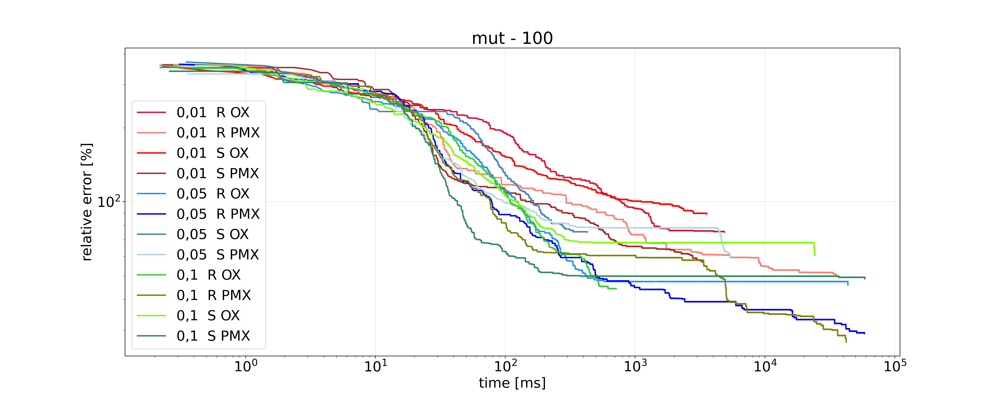

# Programowanie Efektywnych Algorytmów - Projekt: Sprawozdanie

| Wydział Elektroniki      | Kierunek: Informatyka Techniczna |
| :----------------------- | -------------------------------: |
| Grupa zajęciowa Wt 17:05 |          Semestr: 2021/2022 Zima |
| Prowadzący:              |            Dr inż. Antoni Sterna |

|        Autor         |
| :------------------: |
| Byczko Maciej 252747 |

- [Programowanie Efektywnych Algorytmów - Projekt: Sprawozdanie](#programowanie-efektywnych-algorytmów---projekt-sprawozdanie)
  - [Wstęp teoretyczny](#wstęp-teoretyczny)
    - [Problem komiwojażera](#problem-komiwojażera)
    - [Algorytm genetyczny](#algorytm-genetyczny)
      - [Opis ogólny](#opis-ogólny)
      - [Wymagane parametry](#wymagane-parametry)
      - [Opis działania operatorów krzyżowania](#opis-działania-operatorów-krzyżowania)
      - [Opis sposobów mutacji](#opis-sposobów-mutacji)
      - [Etapy działania algorytmu](#etapy-działania-algorytmu)
  - [Opis zastosowanych klas w programie](#opis-zastosowanych-klas-w-programie)
  - [Plan eksperymentu](#plan-eksperymentu)
  - [Wyniki eksperymentów](#wyniki-eksperymentów)
    - [populacja](#populacja)
    - [mutacja](#mutacja)
    - [mieszanie (crossbreed)](#mieszanie-crossbreed)
  - [Wnioski](#wnioski)
  - [Bibliografia](#bibliografia)

## Wstęp teoretyczny

### Problem komiwojażera

Problem komiwojażera (ang. travelling salesman problem, TSP) – zagadnienie optymalizacyjne, polegające na znalezieniu drogi o najmniejszym koszcie.
komiwojażer - przedstawiciel firmy podróżujący w celu zdobywania klientów i przyjmowania zamówień na towar. (definicja ze słownika)
W celu zobrazowania problemu należy wyobrazić sobie tytułowego komiwojażera, który podróżuje między miastami w celu wykonywania swojej pracy. Podróż zaczyna z siedziby swojej firmy po czym jego trasa przebiega przez każde miasto dokładnie jeden raz, aż w końcu wraca z powrotem do głównego budynku firmy. Matematycznie prezentujemy ten problem jako graf którego wierzchołki są miastami a łączące je trasy to krawędzie z odpowiednimi wagami. Jest to pełny graf ważony oraz może być skierowany, co tworzy problem asymetryczny.
Rozwiązanie problemu komiwojażera sprowadza się do znalezienia właściwego - o najmniejszej sumie wag krawędzi - cyklu Hamiltona, czyli cyklu przechodzącego przez każdy wierzchołek grafu dokładnie jeden raz. Przeszukanie wszystkich cykli (czyli zastosowanie metody _Brute Force_(przegląd zupełny)) nie jest optymalną metodą, jako że prowadzi do wykładniczej złożoności obliczeniowej - $O(n!)$, dla której problemy o dużym $n$ traktowane jako nierozwiązywalne. Klasyfikuje to problem komiwojażera jako problem NP-trudny, czyli niedający rozwiązania w czasie wielomianowym. To powoduje konieczność skorzystania z tzw. algorytmów heurystycznych bądź metaheurystycznych (bardziej ogólnych), np. algorytmy _Tabu search_ bądź _Simulated annealing_. W naszym przypadku zagłębimy się w dziedzinę algorytmów ewolucyjnych, głównie _algorytm genetyczny_.

### Algorytm genetyczny

#### Opis ogólny

Algorytm genetyczny jest to rodzaj heurystyki, należy do grupy algorytmów ewolucyjnych, gdyż jego sposób działania jest zaczerpnięty z ewolucji biologicznej. Ewolucja rozpoczyna się od utworzenia początkowej populacji, stosowanie operatorów krzyżowania (rozmnażania) i mutacji (wpływ otoczenia na osobnika, np. wirus) tak aby dojść do rozwiązania jak najbliższego optymalnemu.

#### Wymagane parametry

- Graf, załadowany z pliku bądź wygenerowany losowo
- Czas działania algorytmu, podawany w sekundach
- Wielkość populacji
- Szansa na mutację
- Wybranie operatora krzyżowania:
  - Partially Matched Crossover (PMX)
  - Order Crossover (OX)
- Wybranie operatora mutacji:
  - Swap - zamiana dwóch elementów
  - Reverse - Zamiana kolejności elementów pomiędzy podanymi indeksami

#### Opis działania operatorów krzyżowania

Przykład działania algorytmów mieszających na przykładowych tablicach:

```m
tablica tab1 = [6,2,3,4,1,7,5]
tablica tab2 = [5,2,4,1,3,7,6]

index a = 2
index b = 5

Przeprowadzenie algorytmu PMX:

Wstawienie fragmentu z tab2:

wynik = [_,2,4,1,3,_,_]

Wypełnienie wartościami które nie posiadają konfliktów:

[_,2,4,1,3,_,_] -> [6,2,4,1,3,7,5]

Przeprowadzenie algorytmu OX:

Skopiowanie z tab1 fragmentu pomiędzy indeksami

wynik = [_,2,3,4,1,_,_]

Następnie dopóki tablica wynikowa nie będzie wypełniona dodajemy elementy z tab2 które się jeszcze nie pojawiły:

wynik = [_,2,3,4,1,_,_] -> [_,2,3,4,1,7,_] -> [_,2,3,4,1,7,6] -> [5,2,3,4,1,7,6]
```

#### Opis sposobów mutacji

Przykład działania mutacji na przykładowej tablicy wartości:

```m
Tablica tab = [0,1,2,3,4,5]

Indeks a = 1
Indeks b = 4

Wynik mutacji Swap(tab, a, b) -> [0,4,2,3,1,5]
Wynik mutacji Reverse(tab, a, b) -> [0,4,3,2,1,5]
```

#### Etapy działania algorytmu

1. Na początku jest generowana losowa populacja $n$ osobników.
2. Ocena osobników - obliczenie ich kosztów
3. Selekcja rodziców
4. Tworzenie nowej populacji
5. Zastąpienie starej populacji jej nowym odpowiednikiem
6. Jeżeli nie przekroczono podanego czasu, przejdź do punktu 2.
7. Zwróć najlepsze rozwiązanie

Opis słownictwa:

- **Selekcja** - Wybór losowy z populacji 2 osobników, porównanie ich i zwracamy lepszego z nich i dodajemy do populacji rodziców. Powtarzamy dopóki liczba rodziców nie będzie identyczna co liczba osobników w populacji.
- **Tworzenie nowej populacji** - Pobranie z kandydatów 2 osobników, przeprowadzenie krzyżowania wybraną metodą oraz przeprowadzenie mutacji z zadaną szansą i zwrócenie osobników wynikowych

## Opis zastosowanych klas w programie

- **Program** - główny plik zawierający menu wraz z interfejsem użytkownika
- **Essentials** - Klasa statyczna z podstawowymi narzędziami jak np. liczenie wartości ścieżki, generowanie losowego problemu, etc.
- **Matrix** - Klasa statyczna reprezentująca problem jako macierz sąsiedztwa wraz z funkcjami na niej operującymi
- **Algorithm** - Klasa statyczna zawierająca wszystkie potrzebne algorytmy i funkcje które głównie działają przy algorytmie genetycznym: krzyżowanie, mutacje oraz sam algorytm.

## Plan eksperymentu

Program został napisany w języku `C#`, w `.NET` Framework, w środowisku `JetBrains Rider`.

Do mierzenia czasu wykorzystano klasę `StopWatch` z przestrzeni nazw `System.Diagnostics`.

Testowane instancje problemu były wielkości:
**17, 100** oraz **443**.

Na wykresie została zastosowana skala logarytmiczna w celu polepszenia czytelności wyników.

Niektóre wyniki zaczynają się nie od zera, spowodowane jest to tym że wykres zaczyna się rysować dopiero po znalezieniu pierwszej lepszej wartości niż wartość domyślna.

Wykres kończy się gdy:

1. Znajdzie poprawne rozwiązanie
2. Skończy się czas
3. Rozwiązanie od danego momentu więcej się nie zmieni

Na wykresach w legendzie zostały zastosowane następujące "kody":

- S - Mutacja typu **Swap**
- R - Mutacja typu **Reverse**
- PMX - Partially Matched Crossover
- OX - Order Crossover

Wartości trzycyfrowe to są wielkości populacji.

Wartości **0.01, 0.05, 0.1** szanse mutacji.

Wartości **0.5, 0.7, 0.9** to szanse mieszania.

Nazwy tabel:
A-B-C-D-E-F gdzie:

- A - Wielkość problemu
- B - Populacja
- C - Szansa mutacji
- D - Szansa mieszania
- E - Sposób mutacji
- F - Sposób mieszania

## Wyniki eksperymentów

### populacja

Przy sprawdzaniu **populacji** zostały sprawdzone 4 różne rozmiary:
**100**, **300**, **500** oraz **1000**.

Szansa mutacji została ustawiona na stałą wartość **0.01**.

Szansa mieszania została ustawiona na stałą wartość **0.8**.

- **17-100-0_01-0_8-R-OX**

|                    |        |        |        |       |       |       |       |       |       |       |       |
| ------------------ | ------ | ------ | ------ | ----- | ----- | ----- | ----- | ----- | ----- | ----- | ----- |
| time [ms]          | 0.1    | 0.35   | 0.47   | 0.56  | 0.65  | 0.94  | 5.67  | 11.69 | 19.98 | 45.08 | 58.53 |
| best road          | 99     | 88     | 86     | 73    | 70    | 62    | 57    | 55    | 45    | 40    | 39    |
| relative error [%] | 153.85 | 125.64 | 120.51 | 87.18 | 79.49 | 58.97 | 46.15 | 41.03 | 15.38 | 2.56  | 0.0   |

- **17-100-0_01-0_8-R-PMX**

|                    |        |       |       |       |       |       |       |       |
| ------------------ | ------ | ----- | ----- | ----- | ----- | ----- | ----- | ----- |
| time [ms]          | 0.48   | 0.61  | 1.39  | 2.48  | 2.75  | 10.72 | 11.01 | 15.35 |
| best road          | 111    | 68    | 59    | 55    | 45    | 44    | 42    | 39    |
| relative error [%] | 184.62 | 74.36 | 51.28 | 41.03 | 15.38 | 12.82 | 7.69  | 0.0   |

- **17-100-0_01-0_8-S-OX**

|                    |        |        |       |       |       |      |       |       |       |        |        |        |
| ------------------ | ------ | ------ | ----- | ----- | ----- | ---- | ----- | ----- | ----- | ------ | ------ | ------ |
| time [ms]          | 0.61   | 0.7    | 1.06  | 1.14  | 4.18  | 4.92 | 5.99  | 10.47 | 29.3  | 142.82 | 144.04 | 150.41 |
| best road          | 85     | 81     | 74    | 69    | 67    | 64   | 61    | 60    | 55    | 50     | 49     | 47     |
| relative error [%] | 117.95 | 107.69 | 89.74 | 76.92 | 71.79 | 64.1 | 56.41 | 53.85 | 41.03 | 28.21  | 25.64  | 20.51  |

- **17-100-0_01-0_8-S-PMX**

|                    |        |        |        |        |       |       |       |       |       |       |        |
| ------------------ | ------ | ------ | ------ | ------ | ----- | ----- | ----- | ----- | ----- | ----- | ------ |
| time [ms]          | 1.66   | 2.13   | 2.45   | 2.71   | 3.22  | 3.59  | 3.68  | 4.21  | 4.46  | 49.03 | 2414.4 |
| best road          | 115    | 108    | 86     | 79     | 68    | 65    | 52    | 47    | 45    | 44    | 42     |
| relative error [%] | 194.87 | 176.92 | 120.51 | 102.56 | 74.36 | 66.67 | 33.33 | 20.51 | 15.38 | 12.82 | 7.69   |

- **17-1000-0_01-0_8-R-OX**

|                    |       |       |       |       |       |       |       |       |      |      |       |
| ------------------ | ----- | ----- | ----- | ----- | ----- | ----- | ----- | ----- | ---- | ---- | ----- |
| time [ms]          | 0.44  | 0.84  | 1.33  | 2.83  | 3.3   | 3.74  | 3.98  | 5.01  | 6.09 | 9.47 | 14.35 |
| best road          | 76    | 73    | 61    | 56    | 50    | 47    | 45    | 43    | 42   | 40   | 39    |
| relative error [%] | 94.87 | 87.18 | 56.41 | 43.59 | 28.21 | 20.51 | 15.38 | 10.26 | 7.69 | 2.56 | 0.0   |

- **17-1000-0_01-0_8-R-PMX**

|                    |        |       |       |       |      |       |       |
| ------------------ | ------ | ----- | ----- | ----- | ---- | ----- | ----- |
| time [ms]          | 0.37   | 0.64  | 1.49  | 2.14  | 4.07 | 30.86 | 62.32 |
| best road          | 81     | 68    | 47    | 44    | 42   | 41    | 39    |
| relative error [%] | 107.69 | 74.36 | 20.51 | 12.82 | 7.69 | 5.13  | 0.0   |

- **17-1000-0_01-0_8-S-OX**

|                    |       |       |       |       |       |       |      |       |       |       |          |
| ------------------ | ----- | ----- | ----- | ----- | ----- | ----- | ---- | ----- | ----- | ----- | -------- |
| time [ms]          | 0.34  | 0.66  | 0.97  | 1.22  | 1.94  | 2.36  | 2.58 | 3.38  | 3.89  | 7.06  | 54753.43 |
| best road          | 71    | 69    | 67    | 65    | 62    | 60    | 53   | 49    | 47    | 46    | 44       |
| relative error [%] | 82.05 | 76.92 | 71.79 | 66.67 | 58.97 | 53.85 | 35.9 | 25.64 | 20.51 | 17.95 | 12.82    |

- **17-1000-0_01-0_8-S-PMX**

|                    |       |       |       |       |       |       |       |       |       |      |       |
| ------------------ | ----- | ----- | ----- | ----- | ----- | ----- | ----- | ----- | ----- | ---- | ----- |
| time [ms]          | 0.26  | 0.95  | 1.18  | 1.63  | 1.87  | 2.1   | 2.78  | 4.48  | 5.15  | 6.3  | 10.85 |
| best road          | 71    | 68    | 60    | 55    | 54    | 52    | 50    | 46    | 44    | 40   | 39    |
| relative error [%] | 82.05 | 74.36 | 53.85 | 41.03 | 38.46 | 33.33 | 28.21 | 17.95 | 12.82 | 2.56 | 0.0   |

- **17-300-0_01-0_8-R-OX**

|                    |       |        |       |       |       |       |       |      |       |       |
| ------------------ | ----- | ------ | ----- | ----- | ----- | ----- | ----- | ---- | ----- | ----- |
| time [ms]          | 0.21  | 0.36   | 0.63  | 0.87  | 1.31  | 2.21  | 4.23  | 9.32 | 35.83 | 49.36 |
| best road          | 103   | 84     | 71    | 65    | 63    | 60    | 49    | 41   | 40    | 39    |
| relative error [%] | 164.1 | 115.38 | 82.05 | 66.67 | 61.54 | 53.85 | 25.64 | 5.13 | 2.56  | 0.0   |

- **17-300-0_01-0_8-R-PMX**

|                    |        |       |       |       |       |       |       |       |      |      |       |
| ------------------ | ------ | ----- | ----- | ----- | ----- | ----- | ----- | ----- | ---- | ---- | ----- |
| time [ms]          | 0.24   | 0.69  | 0.87  | 1.08  | 1.28  | 2.9   | 3.61  | 4.23  | 5.79 | 7.2  | 20.72 |
| best road          | 82     | 78    | 75    | 73    | 59    | 56    | 49    | 46    | 42   | 40   | 39    |
| relative error [%] | 110.26 | 100.0 | 92.31 | 87.18 | 51.28 | 43.59 | 25.64 | 17.95 | 7.69 | 2.56 | 0.0   |

- **17-300-0_01-0_8-S-OX**

|                    |        |        |       |       |       |      |       |       |      |      |         |
| ------------------ | ------ | ------ | ----- | ----- | ----- | ---- | ----- | ----- | ---- | ---- | ------- |
| time [ms]          | 0.44   | 0.61   | 0.73  | 0.84  | 1.05  | 1.28 | 1.61  | 1.86  | 4.01 | 4.68 | 2685.52 |
| best road          | 88     | 81     | 69    | 66    | 58    | 53   | 48    | 43    | 42   | 40   | 39      |
| relative error [%] | 125.64 | 107.69 | 76.92 | 69.23 | 48.72 | 35.9 | 23.08 | 10.26 | 7.69 | 2.56 | 0.0     |

- **17-300-0_01-0_8-S-PMX**

|                    |        |        |        |       |       |       |       |       |       |       |
| ------------------ | ------ | ------ | ------ | ----- | ----- | ----- | ----- | ----- | ----- | ----- |
| time [ms]          | 0.14   | 0.27   | 0.42   | 0.53  | 1.16  | 2.36  | 3.41  | 3.51  | 3.85  | 4.1   |
| best road          | 91     | 89     | 82     | 69    | 60    | 55    | 54    | 47    | 46    | 44    |
| relative error [%] | 133.33 | 128.21 | 110.26 | 76.92 | 53.85 | 41.03 | 38.46 | 20.51 | 17.95 | 12.82 |

- **17-500-0_01-0_8-R-OX**

|                    |       |       |       |       |       |       |       |      |      |        |        |
| ------------------ | ----- | ----- | ----- | ----- | ----- | ----- | ----- | ---- | ---- | ------ | ------ |
| time [ms]          | 0.33  | 0.62  | 0.88  | 1.49  | 1.63  | 2.02  | 4.22  | 4.34 | 6.69 | 654.85 | 658.03 |
| best road          | 73    | 68    | 57    | 56    | 49    | 47    | 44    | 42   | 41   | 40     | 39     |
| relative error [%] | 87.18 | 74.36 | 46.15 | 43.59 | 25.64 | 20.51 | 12.82 | 7.69 | 5.13 | 2.56   | 0.0    |

- **17-500-0_01-0_8-R-PMX**

|                    |       |       |       |       |       |       |       |      |       |
| ------------------ | ----- | ----- | ----- | ----- | ----- | ----- | ----- | ---- | ----- |
| time [ms]          | 0.22  | 0.53  | 1.26  | 2.31  | 3.22  | 3.73  | 4.02  | 5.29 | 10.49 |
| best road          | 66    | 60    | 54    | 51    | 47    | 45    | 44    | 42   | 39    |
| relative error [%] | 69.23 | 53.85 | 38.46 | 30.77 | 20.51 | 15.38 | 12.82 | 7.69 | 0.0   |

- **17-500-0_01-0_8-S-OX**

|                    |        |       |       |       |       |        |
| ------------------ | ------ | ----- | ----- | ----- | ----- | ------ |
| time [ms]          | 0.26   | 0.49  | 2.3   | 3.28  | 7.44  | 239.49 |
| best road          | 80     | 62    | 58    | 57    | 47    | 44     |
| relative error [%] | 105.13 | 58.97 | 48.72 | 46.15 | 20.51 | 12.82  |

- **17-500-0_01-0_8-S-PMX**

|                    |       |       |       |       |       |       |       |      |
| ------------------ | ----- | ----- | ----- | ----- | ----- | ----- | ----- | ---- |
| time [ms]          | 0.26  | 0.45  | 0.61  | 1.23  | 1.59  | 2.45  | 4.57  | 5.07 |
| best road          | 92    | 73    | 65    | 55    | 52    | 47    | 44    | 42   |
| relative error [%] | 135.9 | 87.18 | 66.67 | 41.03 | 33.33 | 20.51 | 12.82 | 7.69 |

- **100-100-0_01-0_8-R-OX**

|                    |        |         |         |         |         |         |        |         |         |         |         |         |         |
| ------------------ | ------ | ------- | ------- | ------- | ------- | ------- | ------ | ------- | ------- | ------- | ------- | ------- | ------- |
| time [ms]          | 0.23   | 17.4    | 42.82   | 96.25   | 153.8   | 251.68  | 306.71 | 385.9   | 527.4   | 860.24  | 1472.42 | 2286.43 | 8406.38 |
| best road          | 169574 | 150165  | 132800  | 125353  | 116026  | 103592  | 96148  | 89222   | 83427   | 76862   | 70271   | 67064   | 62800   |
| relative error [%] | 9384.0 | 8298.49 | 7327.29 | 6910.79 | 6389.15 | 5693.74 | 5277.4 | 4890.04 | 4565.94 | 4198.77 | 3830.15 | 3650.78 | 3412.3  |

- **100-100-0_01-0_8-R-PMX**

|                    |         |         |         |         |         |         |         |        |        |         |         |          |          |
| ------------------ | ------- | ------- | ------- | ------- | ------- | ------- | ------- | ------ | ------ | ------- | ------- | -------- | -------- |
| time [ms]          | 0.17    | 6.68    | 15.76   | 38.76   | 82.24   | 141.89  | 275.11  | 336.84 | 420.0  | 529.25  | 2794.6  | 20603.17 | 42976.58 |
| best road          | 169272  | 126716  | 106629  | 102662  | 92513   | 85370   | 80889   | 73426  | 68788  | 65357   | 58779   | 56810    | 51537    |
| relative error [%] | 9367.11 | 6987.02 | 5863.59 | 5641.72 | 5074.11 | 4674.61 | 4423.99 | 4006.6 | 3747.2 | 3555.31 | 3187.42 | 3077.29  | 2782.38  |

- **100-100-0_01-0_8-S-OX**

|                    |         |         |         |         |         |         |         |         |         |         |         |         |         |
| ------------------ | ------- | ------- | ------- | ------- | ------- | ------- | ------- | ------- | ------- | ------- | ------- | ------- | ------- |
| time [ms]          | 0.2     | 11.62   | 27.37   | 45.98   | 76.04   | 136.31  | 171.96  | 223.74  | 295.92  | 484.16  | 630.69  | 1227.15 | 4458.83 |
| best road          | 168151  | 147844  | 134524  | 119085  | 109775  | 99258   | 92484   | 84467   | 79078   | 74078   | 70600   | 66766   | 63096   |
| relative error [%] | 9304.42 | 8168.68 | 7423.71 | 6560.23 | 6039.54 | 5451.34 | 5072.48 | 4624.11 | 4322.71 | 4043.06 | 3848.55 | 3634.12 | 3428.86 |

- **100-100-0_01-0_8-S-PMX**

|                    |         |         |        |         |         |         |         |        |         |         |         |         |         |
| ------------------ | ------- | ------- | ------ | ------- | ------- | ------- | ------- | ------ | ------- | ------- | ------- | ------- | ------- |
| time [ms]          | 0.38    | 6.96    | 12.74  | 41.81   | 84.09   | 149.31  | 201.13  | 310.79 | 561.16  | 990.94  | 1586.13 | 2322.29 | 9489.8  |
| best road          | 167369  | 126983  | 116263 | 106619  | 97885   | 90634   | 85890   | 81009  | 74756   | 71370   | 67545   | 64259   | 61353   |
| relative error [%] | 9260.68 | 7001.96 | 6402.4 | 5863.03 | 5374.55 | 4969.02 | 4703.69 | 4430.7 | 4080.98 | 3891.61 | 3677.68 | 3493.9  | 3331.38 |

- **100-1000-0_01-0_8-R-OX**

|                    |         |         |         |        |         |         |         |        |         |         |         |         |         |
| ------------------ | ------- | ------- | ------- | ------ | ------- | ------- | ------- | ------ | ------- | ------- | ------- | ------- | ------- |
| time [ms]          | 0.5     | 11.58   | 33.46   | 63.36  | 119.72  | 160.87  | 222.74  | 287.21 | 424.61  | 595.4   | 837.6   | 1526.62 | 2802.02 |
| best road          | 158586  | 132162  | 118792  | 110754 | 101545  | 94086   | 86188   | 79600  | 73993   | 70633   | 67747   | 64294   | 59916   |
| relative error [%] | 8769.46 | 7291.61 | 6543.85 | 6094.3 | 5579.25 | 5162.08 | 4720.36 | 4351.9 | 4038.31 | 3850.39 | 3688.98 | 3495.86 | 3251.01 |

- **100-1000-0_01-0_8-R-PMX**

|                    |         |         |         |         |        |         |         |         |         |         |         |         |         |
| ------------------ | ------- | ------- | ------- | ------- | ------ | ------- | ------- | ------- | ------- | ------- | ------- | ------- | ------- |
| time [ms]          | 0.61    | 25.13   | 48.52   | 63.77   | 79.17  | 92.92   | 102.92  | 116.42  | 133.85  | 234.15  | 321.56  | 639.03  | 1703.57 |
| best road          | 159867  | 136247  | 118546  | 99593   | 89096  | 75230   | 67992   | 63603   | 61626   | 57767   | 56219   | 52419   | 50174   |
| relative error [%] | 8841.11 | 7520.08 | 6530.09 | 5470.08 | 4883.0 | 4107.49 | 3702.68 | 3457.21 | 3346.64 | 3130.82 | 3044.24 | 2831.71 | 2706.15 |

- **100-1000-0_01-0_8-S-OX**

|                    |         |         |         |         |        |         |         |         |         |         |         |         |         |
| ------------------ | ------- | ------- | ------- | ------- | ------ | ------- | ------- | ------- | ------- | ------- | ------- | ------- | ------- |
| time [ms]          | 0.65    | 12.73   | 33.72   | 50.14   | 72.72  | 103.97  | 129.5   | 172.58  | 402.33  | 501.75  | 623.93  | 1101.61 | 1451.24 |
| best road          | 160644  | 132673  | 122102  | 116743  | 111058 | 105341  | 102433  | 98500   | 84863   | 80585   | 78668   | 74978   | 72345   |
| relative error [%] | 8884.56 | 7320.19 | 6728.97 | 6429.25 | 6111.3 | 5791.55 | 5628.91 | 5408.95 | 4646.25 | 4406.99 | 4299.78 | 4093.4  | 3946.14 |

- **100-1000-0_01-0_8-S-PMX**

|                    |         |         |         |         |         |        |         |         |         |         |         |         |
| ------------------ | ------- | ------- | ------- | ------- | ------- | ------ | ------- | ------- | ------- | ------- | ------- | ------- |
| time [ms]          | 1.41    | 48.36   | 78.61   | 98.33   | 119.06  | 137.17 | 149.75  | 161.84  | 196.63  | 304.73  | 435.55  | 617.72  |
| best road          | 159728  | 125549  | 111071  | 94270   | 82941   | 72970  | 66993   | 62937   | 60053   | 56606   | 54570   | 53196   |
| relative error [%] | 8833.33 | 6921.76 | 6112.02 | 5172.37 | 4538.76 | 3981.1 | 3646.81 | 3419.97 | 3258.67 | 3065.88 | 2952.01 | 2875.17 |

- **100-300-0_01-0_8-R-OX**

|                    |         |         |         |         |         |         |         |         |         |         |         |         |         |
| ------------------ | ------- | ------- | ------- | ------- | ------- | ------- | ------- | ------- | ------- | ------- | ------- | ------- | ------- |
| time [ms]          | 0.23    | 5.17    | 16.76   | 56.54   | 83.45   | 113.48  | 137.74  | 213.16  | 381.47  | 607.79  | 866.99  | 1318.61 | 1738.63 |
| best road          | 167366  | 143693  | 129849  | 115669  | 107337  | 103009  | 94146   | 85736   | 80683   | 74670   | 70767   | 67058   | 64360   |
| relative error [%] | 9260.51 | 7936.52 | 7162.25 | 6369.18 | 5903.19 | 5661.13 | 5165.44 | 4695.08 | 4412.47 | 4076.17 | 3857.89 | 3650.45 | 3499.55 |

- **100-300-0_01-0_8-R-PMX**

|                    |         |        |         |         |         |         |         |         |         |         |         |         |          |
| ------------------ | ------- | ------ | ------- | ------- | ------- | ------- | ------- | ------- | ------- | ------- | ------- | ------- | -------- |
| time [ms]          | 0.28    | 13.36  | 25.44   | 32.99   | 39.02   | 50.58   | 93.04   | 193.11  | 429.72  | 853.4   | 1165.27 | 5394.7  | 11487.51 |
| best road          | 167352  | 135382 | 110909  | 102518  | 88569   | 85555   | 80184   | 76129   | 70489   | 65698   | 62280   | 57730   | 55326    |
| relative error [%] | 9259.73 | 7471.7 | 6102.96 | 5633.67 | 4853.52 | 4684.96 | 4384.56 | 4157.77 | 3842.34 | 3574.38 | 3383.22 | 3128.75 | 2994.3   |

- **100-300-0_01-0_8-S-OX**

|                    |         |         |         |         |         |         |         |         |         |         |         |         |         |
| ------------------ | ------- | ------- | ------- | ------- | ------- | ------- | ------- | ------- | ------- | ------- | ------- | ------- | ------- |
| time [ms]          | 0.23    | 5.7     | 30.48   | 47.62   | 74.95   | 99.37   | 142.03  | 177.11  | 256.29  | 363.29  | 510.25  | 943.35  | 2365.0  |
| best road          | 165589  | 137618  | 118053  | 105484  | 96253   | 91835   | 86040   | 83183   | 80833   | 78514   | 75632   | 72703   | 69632   |
| relative error [%] | 9161.13 | 7596.76 | 6502.52 | 5799.55 | 5283.28 | 5036.19 | 4712.08 | 4552.29 | 4420.86 | 4291.16 | 4129.98 | 3966.16 | 3794.41 |

- **100-300-0_01-0_8-S-PMX**

|                    |         |         |         |         |        |         |         |         |         |         |         |         |         |
| ------------------ | ------- | ------- | ------- | ------- | ------ | ------- | ------- | ------- | ------- | ------- | ------- | ------- | ------- |
| time [ms]          | 1.42    | 14.26   | 21.43   | 26.84   | 32.0   | 39.64   | 70.66   | 223.13  | 381.76  | 524.23  | 657.06  | 1431.3  | 2660.22 |
| best road          | 163878  | 133294  | 114222  | 96290   | 86026  | 81357   | 77972   | 70970   | 67288   | 64243   | 61615   | 59658   | 58232   |
| relative error [%] | 9065.44 | 7354.92 | 6288.26 | 5285.35 | 4711.3 | 4450.17 | 4260.85 | 3869.24 | 3663.31 | 3493.01 | 3346.03 | 3236.58 | 3156.82 |

- **100-500-0_01-0_8-R-OX**

|                    |         |        |         |         |        |         |         |         |         |         |         |         |         |
| ------------------ | ------- | ------ | ------- | ------- | ------ | ------- | ------- | ------- | ------- | ------- | ------- | ------- | ------- |
| time [ms]          | 0.33    | 4.82   | 34.18   | 97.72   | 116.58 | 156.23  | 198.16  | 252.82  | 350.76  | 516.3   | 676.43  | 894.86  | 1656.34 |
| best road          | 168909  | 133315 | 118452  | 106639  | 102059 | 92773   | 84028   | 80046   | 75039   | 69179   | 64666   | 60796   | 57208   |
| relative error [%] | 9346.81 | 7356.1 | 6524.83 | 5864.15 | 5608.0 | 5088.65 | 4599.55 | 4376.85 | 4096.81 | 3769.07 | 3516.67 | 3300.22 | 3099.55 |

- **100-500-0_01-0_8-R-PMX**

|                    |         |         |         |         |         |        |         |         |         |         |         |         |          |
| ------------------ | ------- | ------- | ------- | ------- | ------- | ------ | ------- | ------- | ------- | ------- | ------- | ------- | -------- |
| time [ms]          | 0.64    | 19.88   | 35.55   | 45.01   | 50.6    | 57.39  | 194.99  | 320.38  | 561.19  | 861.66  | 1292.7  | 2751.82 | 12710.63 |
| best road          | 164802  | 129429  | 103146  | 83974   | 76985   | 72886  | 69404   | 66518   | 63240   | 58267   | 55070   | 53384   | 50660    |
| relative error [%] | 9117.11 | 7138.76 | 5668.79 | 4596.53 | 4205.65 | 3976.4 | 3781.66 | 3620.25 | 3436.91 | 3158.78 | 2979.98 | 2885.68 | 2733.33  |

- **100-500-0_01-0_8-S-OX**

|                    |         |         |         |         |         |         |         |         |         |         |         |         |         |
| ------------------ | ------- | ------- | ------- | ------- | ------- | ------- | ------- | ------- | ------- | ------- | ------- | ------- | ------- |
| time [ms]          | 0.51    | 6.37    | 27.29   | 42.93   | 68.08   | 100.5   | 130.35  | 180.32  | 232.29  | 332.8   | 502.05  | 904.95  | 1275.45 |
| best road          | 165240  | 130343  | 117918  | 107424  | 97923   | 92499   | 83946   | 77591   | 72397   | 66474   | 64071   | 58028   | 55076   |
| relative error [%] | 9141.61 | 7189.88 | 6494.97 | 5908.05 | 5376.68 | 5073.32 | 4594.97 | 4239.54 | 3949.05 | 3617.79 | 3483.39 | 3145.41 | 2980.31 |

- **100-500-0_01-0_8-S-PMX**

|                    |         |         |         |         |        |         |         |        |         |         |         |         |         |
| ------------------ | ------- | ------- | ------- | ------- | ------ | ------- | ------- | ------ | ------- | ------- | ------- | ------- | ------- |
| time [ms]          | 0.5     | 30.44   | 44.21   | 59.6    | 68.77  | 79.33   | 115.82  | 161.03 | 285.54  | 482.49  | 790.48  | 2109.78 | 4404.67 |
| best road          | 155841  | 121784  | 98777   | 83370   | 73494  | 70439   | 67089   | 63946  | 60747   | 58735   | 55118   | 53288   | 51577   |
| relative error [%] | 8615.94 | 6711.19 | 5424.44 | 4562.75 | 4010.4 | 3839.54 | 3652.18 | 3476.4 | 3297.48 | 3184.96 | 2982.66 | 2880.31 | 2784.62 |

- **443-100-0_01-0_8-R-OX**

|                    |        |        |        |        |         |         |         |         |          |          |          |          |          |
| ------------------ | ------ | ------ | ------ | ------ | ------- | ------- | ------- | ------- | -------- | -------- | -------- | -------- | -------- |
| time [ms]          | 0.38   | 56.55  | 313.38 | 765.75 | 2003.52 | 4257.99 | 6027.48 | 8822.66 | 13017.72 | 16562.93 | 22442.34 | 32083.46 | 54370.26 |
| best road          | 7954   | 7692   | 7347   | 7092   | 6903    | 6752    | 6598    | 6451    | 6312     | 6177     | 6064     | 5935     | 5784     |
| relative error [%] | 192.43 | 182.79 | 170.11 | 160.74 | 153.79  | 148.24  | 142.57  | 137.17  | 132.06   | 127.1    | 122.94   | 118.2    | 112.65   |

- **443-100-0_01-0_8-R-PMX**

|                    |        |        |       |        |        |        |         |         |         |          |          |          |          |
| ------------------ | ------ | ------ | ----- | ------ | ------ | ------ | ------- | ------- | ------- | -------- | -------- | -------- | -------- |
| time [ms]          | 0.46   | 11.5   | 20.58 | 35.1   | 567.97 | 1243.1 | 2155.71 | 4958.63 | 7498.14 | 14959.34 | 23020.04 | 32511.85 | 50155.88 |
| best road          | 7864   | 7320   | 6819  | 6660   | 6519   | 6421   | 6278    | 6110    | 5978    | 5829     | 5728     | 5688     | 5602     |
| relative error [%] | 189.12 | 169.12 | 150.7 | 144.85 | 139.67 | 136.07 | 130.81  | 124.63  | 119.78  | 114.3    | 110.59   | 109.12   | 105.96   |

- **443-100-0_01-0_8-S-OX**

|                    |       |        |        |        |        |        |         |         |         |         |         |          |          |
| ------------------ | ----- | ------ | ------ | ------ | ------ | ------ | ------- | ------- | ------- | ------- | ------- | -------- | -------- |
| time [ms]          | 0.45  | 73.97  | 176.39 | 304.11 | 466.13 | 684.78 | 1016.45 | 1390.19 | 2053.26 | 3626.56 | 6526.63 | 17477.37 | 49549.93 |
| best road          | 7831  | 7164   | 6567   | 6033   | 5620   | 5254   | 4939    | 4671    | 4412    | 4122    | 3848    | 3474     | 3179     |
| relative error [%] | 187.9 | 163.38 | 141.43 | 121.8  | 106.62 | 93.16  | 81.58   | 71.73   | 62.21   | 51.54   | 41.47   | 27.72    | 16.88    |

- **443-100-0_01-0_8-S-PMX**

|                    |        |        |        |        |        |       |         |         |         |         |          |          |          |
| ------------------ | ------ | ------ | ------ | ------ | ------ | ----- | ------- | ------- | ------- | ------- | -------- | -------- | -------- |
| time [ms]          | 0.43   | 56.49  | 180.56 | 323.67 | 546.34 | 912.4 | 1759.69 | 3094.17 | 4322.04 | 6758.49 | 11635.74 | 23666.07 | 53838.62 |
| best road          | 7867   | 6582   | 6132   | 5723   | 5323   | 4916  | 4609    | 4367    | 4159    | 3917    | 3687     | 3435     | 3218     |
| relative error [%] | 189.23 | 141.99 | 125.44 | 110.4  | 95.7   | 80.74 | 69.45   | 60.55   | 52.9    | 44.01   | 35.55    | 26.29    | 18.31    |

- **443-1000-0_01-0_8-R-OX**

|                    |        |       |        |         |         |         |         |          |          |          |          |          |
| ------------------ | ------ | ----- | ------ | ------- | ------- | ------- | ------- | -------- | -------- | -------- | -------- | -------- |
| time [ms]          | 1.87   | 42.84 | 315.46 | 1141.47 | 2916.52 | 6346.02 | 9543.12 | 11764.87 | 15924.81 | 21373.71 | 28135.95 | 43747.72 |
| best road          | 7834   | 7344  | 7073   | 6771    | 6584    | 6400    | 6270    | 6170     | 5991     | 5885     | 5736     | 5659     |
| relative error [%] | 188.01 | 170.0 | 160.04 | 148.93  | 142.06  | 135.29  | 130.51  | 126.84   | 120.26   | 116.36   | 110.88   | 108.05   |

- **443-1000-0_01-0_8-R-PMX**

|                    |        |        |        |         |        |         |         |         |         |         |         |          |          |
| ------------------ | ------ | ------ | ------ | ------- | ------ | ------- | ------- | ------- | ------- | ------- | ------- | -------- | -------- |
| time [ms]          | 3.47   | 167.72 | 904.28 | 1451.47 | 1923.7 | 2203.36 | 2354.77 | 2459.08 | 2517.19 | 2601.84 | 4335.01 | 14514.55 | 31848.45 |
| best road          | 7728   | 7276   | 6683   | 6019    | 5429   | 5123    | 4837    | 4643    | 4573    | 4518    | 4485    | 4403     | 4336     |
| relative error [%] | 184.12 | 167.5  | 145.7  | 121.29  | 99.6   | 88.35   | 77.83   | 70.7    | 68.12   | 66.1    | 64.89   | 61.88    | 59.41    |

- **443-1000-0_01-0_8-S-OX**

|                    |        |        |        |        |         |         |         |         |         |         |         |          |          |
| ------------------ | ------ | ------ | ------ | ------ | ------- | ------- | ------- | ------- | ------- | ------- | ------- | -------- | -------- |
| time [ms]          | 2.19   | 290.74 | 568.44 | 965.16 | 1338.48 | 1738.95 | 2179.59 | 2996.42 | 3954.15 | 5177.69 | 8246.09 | 14558.05 | 45057.79 |
| best road          | 7865   | 6934   | 6465   | 6020   | 5667    | 5384    | 5110    | 4793    | 4516    | 4268    | 3925    | 3571     | 3229     |
| relative error [%] | 189.15 | 154.93 | 137.68 | 121.32 | 108.35  | 97.94   | 87.87   | 76.21   | 66.03   | 56.91   | 44.3    | 31.29    | 18.71    |

- **443-1000-0_01-0_8-S-PMX**

|                    |        |         |         |         |         |         |         |         |         |         |         |         |          |
| ------------------ | ------ | ------- | ------- | ------- | ------- | ------- | ------- | ------- | ------- | ------- | ------- | ------- | -------- |
| time [ms]          | 3.18   | 1246.19 | 1879.46 | 2256.86 | 2474.23 | 2958.74 | 3692.63 | 4812.02 | 6872.44 | 9956.44 | 14704.9 | 26691.3 | 58472.41 |
| best road          | 7691   | 6322    | 5189    | 4553    | 4334    | 4168    | 3994    | 3838    | 3715    | 3560    | 3379    | 3232    | 3077     |
| relative error [%] | 182.76 | 132.43  | 90.77   | 67.39   | 59.34   | 53.24   | 46.84   | 41.1    | 36.58   | 30.88   | 24.23   | 18.82   | 13.12    |

- **443-300-0_01-0_8-R-OX**

|                    |        |       |        |        |         |         |         |         |          |         |          |          |          |
| ------------------ | ------ | ----- | ------ | ------ | ------- | ------- | ------- | ------- | -------- | ------- | -------- | -------- | -------- |
| time [ms]          | 0.72   | 22.94 | 282.18 | 836.04 | 1986.89 | 3010.07 | 5430.59 | 7789.82 | 12055.83 | 15864.7 | 23397.38 | 37153.97 | 57256.53 |
| best road          | 7950   | 7567  | 7287   | 7062   | 6868    | 6711    | 6487    | 6309    | 6164     | 6000    | 5857     | 5780     | 5689     |
| relative error [%] | 192.28 | 178.2 | 167.9  | 159.63 | 152.5   | 146.73  | 138.49  | 131.95  | 126.62   | 120.59  | 115.33   | 112.5    | 109.15   |

- **443-300-0_01-0_8-R-PMX**

|                    |        |        |        |        |        |        |        |        |         |         |          |          |          |
| ------------------ | ------ | ------ | ------ | ------ | ------ | ------ | ------ | ------ | ------- | ------- | -------- | -------- | -------- |
| time [ms]          | 1.0    | 39.85  | 81.35  | 114.28 | 160.21 | 179.22 | 194.84 | 211.27 | 2720.54 | 9747.12 | 21680.93 | 42353.28 | 58078.91 |
| best road          | 7734   | 7351   | 7011   | 6560   | 6171   | 5940   | 5764   | 5677   | 5607    | 5477    | 5410     | 5345     | 5250     |
| relative error [%] | 184.34 | 170.26 | 157.76 | 141.18 | 126.88 | 118.38 | 111.91 | 108.71 | 106.14  | 101.36  | 98.9     | 96.51    | 93.01    |

- **443-300-0_01-0_8-S-OX**

|                    |        |        |        |        |        |         |         |         |         |         |          |          |          |
| ------------------ | ------ | ------ | ------ | ------ | ------ | ------- | ------- | ------- | ------- | ------- | -------- | -------- | -------- |
| time [ms]          | 0.72   | 133.68 | 354.67 | 581.88 | 849.07 | 1354.15 | 1977.42 | 3021.35 | 4641.86 | 7632.83 | 13414.43 | 23254.85 | 59036.61 |
| best road          | 7821   | 6872   | 6134   | 5628   | 5276   | 4858    | 4529    | 4228    | 3954    | 3737    | 3489     | 3307     | 3082     |
| relative error [%] | 187.54 | 152.65 | 125.51 | 106.91 | 93.97  | 78.6    | 66.51   | 55.44   | 45.37   | 37.39   | 28.27    | 21.58    | 13.31    |

- **443-300-0_01-0_8-S-PMX**

|                    |        |        |        |        |        |         |         |         |         |         |         |          |          |
| ------------------ | ------ | ------ | ------ | ------ | ------ | ------- | ------- | ------- | ------- | ------- | ------- | -------- | -------- |
| time [ms]          | 0.78   | 170.61 | 268.65 | 477.85 | 732.06 | 1135.12 | 1672.34 | 2677.09 | 3912.85 | 5842.76 | 9294.43 | 20245.08 | 53301.42 |
| best road          | 7878   | 5899   | 5456   | 5146   | 4846   | 4654    | 4441    | 4243    | 4006    | 3801    | 3621    | 3410     | 3203     |
| relative error [%] | 189.63 | 116.88 | 100.59 | 89.19  | 78.16  | 71.1    | 63.27   | 55.99   | 47.28   | 39.74   | 33.12   | 25.37    | 17.76    |

- **443-500-0_01-0_8-R-OX**

|                    |        |        |        |        |         |         |         |         |          |          |          |          |          |
| ------------------ | ------ | ------ | ------ | ------ | ------- | ------- | ------- | ------- | -------- | -------- | -------- | -------- | -------- |
| time [ms]          | 1.2    | 23.94  | 303.87 | 908.24 | 2769.91 | 4173.46 | 6183.12 | 9429.99 | 12215.23 | 19433.73 | 27457.81 | 38292.63 | 54340.82 |
| best road          | 7787   | 7269   | 7044   | 6750   | 6594    | 6444    | 6339    | 6165    | 6057     | 5959     | 5844     | 5741     | 5666     |
| relative error [%] | 186.29 | 167.24 | 158.97 | 148.16 | 142.43  | 136.91  | 133.05  | 126.65  | 122.68   | 119.08   | 114.85   | 111.07   | 108.31   |

- **443-500-0_01-0_8-R-PMX**

|                    |        |        |        |        |        |       |        |        |        |         |          |          |          |
| ------------------ | ------ | ------ | ------ | ------ | ------ | ----- | ------ | ------ | ------ | ------- | -------- | -------- | -------- |
| time [ms]          | 1.47   | 201.08 | 317.71 | 372.82 | 438.81 | 478.2 | 532.04 | 580.75 | 639.01 | 3567.39 | 17716.21 | 24060.37 | 44350.13 |
| best road          | 7768   | 6815   | 6260   | 5792   | 5507   | 5303  | 5155   | 5020   | 4912   | 4871    | 4731     | 4627     | 4499     |
| relative error [%] | 185.59 | 150.55 | 130.15 | 112.94 | 102.46 | 94.96 | 89.52  | 84.56  | 80.59  | 79.08   | 73.93    | 70.11    | 65.4     |

- **443-500-0_01-0_8-S-OX**

|                    |        |        |        |        |         |         |         |         |         |         |         |         |          |
| ------------------ | ------ | ------ | ------ | ------ | ------- | ------- | ------- | ------- | ------- | ------- | ------- | ------- | -------- |
| time [ms]          | 1.53   | 153.94 | 378.89 | 677.38 | 1036.82 | 1536.78 | 2214.41 | 3011.04 | 4138.62 | 6132.37 | 9055.41 | 15466.8 | 36808.17 |
| best road          | 7786   | 6908   | 6219   | 5719   | 5354    | 5005    | 4724    | 4463    | 4201    | 3920    | 3705    | 3435    | 3206     |
| relative error [%] | 186.25 | 153.97 | 128.64 | 110.26 | 96.84   | 84.01   | 73.68   | 64.08   | 54.45   | 44.12   | 36.21   | 26.29   | 17.87    |

- **443-500-0_01-0_8-S-PMX**

|                    |        |        |        |        |        |         |         |         |         |         |          |         |
| ------------------ | ------ | ------ | ------ | ------ | ------ | ------- | ------- | ------- | ------- | ------- | -------- | ------- |
| time [ms]          | 1.08   | 335.15 | 498.96 | 626.02 | 910.23 | 1487.22 | 2278.96 | 3517.42 | 6111.69 | 10381.4 | 15061.32 | 24594.3 |
| best road          | 7726   | 6021   | 5182   | 4776   | 4567   | 4356    | 4186    | 3978    | 3789    | 3625    | 3468     | 3316    |
| relative error [%] | 184.04 | 121.36 | 90.51  | 75.59  | 67.9   | 60.15   | 53.9    | 46.25   | 39.3    | 33.27   | 27.5     | 21.91   |


### mutacja

Przy sprawdzaniu **mutacji** zostały sprawdzone 3 wartości:
**0.01, 0.05** oraz **0.1**.

Populacja została ustawiona na stałą wartość 300 ponieważ to był wynik optymalny dla każdego rozmiaru.

<!-- (bez faworyzacji żadnego rozmiaru). -->

Szansa mieszania została ustawiona na stałą wartość **0.8**.

- **17-300-0_01-0_8-R-OX**

|                    |       |        |       |       |       |       |       |      |       |       |
| ------------------ | ----- | ------ | ----- | ----- | ----- | ----- | ----- | ---- | ----- | ----- |
| time [ms]          | 0.21  | 0.36   | 0.63  | 0.87  | 1.31  | 2.21  | 4.23  | 9.32 | 35.83 | 49.36 |
| best road          | 103   | 84     | 71    | 65    | 63    | 60    | 49    | 41   | 40    | 39    |
| relative error [%] | 164.1 | 115.38 | 82.05 | 66.67 | 61.54 | 53.85 | 25.64 | 5.13 | 2.56  | 0.0   |

- **17-300-0_01-0_8-R-PMX**

|                    |        |       |       |       |       |       |       |       |      |      |       |
| ------------------ | ------ | ----- | ----- | ----- | ----- | ----- | ----- | ----- | ---- | ---- | ----- |
| time [ms]          | 0.24   | 0.69  | 0.87  | 1.08  | 1.28  | 2.9   | 3.61  | 4.23  | 5.79 | 7.2  | 20.72 |
| best road          | 82     | 78    | 75    | 73    | 59    | 56    | 49    | 46    | 42   | 40   | 39    |
| relative error [%] | 110.26 | 100.0 | 92.31 | 87.18 | 51.28 | 43.59 | 25.64 | 17.95 | 7.69 | 2.56 | 0.0   |

- **17-300-0_01-0_8-S-OX**

|                    |        |        |       |       |       |      |       |       |      |      |         |
| ------------------ | ------ | ------ | ----- | ----- | ----- | ---- | ----- | ----- | ---- | ---- | ------- |
| time [ms]          | 0.44   | 0.61   | 0.73  | 0.84  | 1.05  | 1.28 | 1.61  | 1.86  | 4.01 | 4.68 | 2685.52 |
| best road          | 88     | 81     | 69    | 66    | 58    | 53   | 48    | 43    | 42   | 40   | 39      |
| relative error [%] | 125.64 | 107.69 | 76.92 | 69.23 | 48.72 | 35.9 | 23.08 | 10.26 | 7.69 | 2.56 | 0.0     |

- **17-300-0_01-0_8-S-PMX**

|                    |        |        |        |       |       |       |       |       |       |       |
| ------------------ | ------ | ------ | ------ | ----- | ----- | ----- | ----- | ----- | ----- | ----- |
| time [ms]          | 0.14   | 0.27   | 0.42   | 0.53  | 1.16  | 2.36  | 3.41  | 3.51  | 3.85  | 4.1   |
| best road          | 91     | 89     | 82     | 69    | 60    | 55    | 54    | 47    | 46    | 44    |
| relative error [%] | 133.33 | 128.21 | 110.26 | 76.92 | 53.85 | 41.03 | 38.46 | 20.51 | 17.95 | 12.82 |

- **17-300-0_05-0_8-R-OX**

|                    |        |       |       |       |       |      |      |       |
| ------------------ | ------ | ----- | ----- | ----- | ----- | ---- | ---- | ----- |
| time [ms]          | 0.17   | 0.47  | 0.73  | 1.51  | 1.83  | 3.69 | 3.98 | 11.86 |
| best road          | 84     | 71    | 61    | 51    | 46    | 42   | 41   | 39    |
| relative error [%] | 115.38 | 82.05 | 56.41 | 30.77 | 17.95 | 7.69 | 5.13 | 0.0   |

- **17-300-0_05-0_8-R-PMX**

|                    |        |        |       |      |       |       |       |       |      |       |       |      |      |       |
| ------------------ | ------ | ------ | ----- | ---- | ----- | ----- | ----- | ----- | ---- | ----- | ----- | ---- | ---- | ----- |
| time [ms]          | 0.14   | 0.25   | 0.55  | 1.63 | 2.11  | 2.21  | 3.26  | 3.5   | 3.61 | 3.74  | 5.28  | 7.45 | 8.45 | 11.05 |
| best road          | 90     | 81     | 67    | 64   | 63    | 60    | 59    | 58    | 53   | 47    | 44    | 42   | 41   | 39    |
| relative error [%] | 130.77 | 107.69 | 71.79 | 64.1 | 61.54 | 53.85 | 51.28 | 48.72 | 35.9 | 20.51 | 12.82 | 7.69 | 5.13 | 0.0   |

- **17-300-0_05-0_8-S-OX**

|                    |        |        |       |       |       |       |       |       |        |         |
| ------------------ | ------ | ------ | ----- | ----- | ----- | ----- | ----- | ----- | ------ | ------- |
| time [ms]          | 0.24   | 0.47   | 0.7   | 1.12  | 1.36  | 3.04  | 3.42  | 43.49 | 495.76 | 3286.28 |
| best road          | 96     | 81     | 62    | 54    | 49    | 48    | 45    | 44    | 41     | 39      |
| relative error [%] | 146.15 | 107.69 | 58.97 | 38.46 | 25.64 | 23.08 | 15.38 | 12.82 | 5.13   | 0.0     |

- **17-300-0_05-0_8-S-PMX**

|                    |       |       |       |       |       |      |      |         |
| ------------------ | ----- | ----- | ----- | ----- | ----- | ---- | ---- | ------- |
| time [ms]          | 0.22  | 1.31  | 2.0   | 3.07  | 3.82  | 4.34 | 5.0  | 1388.82 |
| best road          | 66    | 63    | 56    | 47    | 45    | 42   | 41   | 39      |
| relative error [%] | 69.23 | 61.54 | 43.59 | 20.51 | 15.38 | 7.69 | 5.13 | 0.0     |

- **17-300-0_1-0_8-R-OX**

|                    |        |        |       |       |      |       |      |      |
| ------------------ | ------ | ------ | ----- | ----- | ---- | ----- | ---- | ---- |
| time [ms]          | 0.28   | 0.47   | 0.58  | 0.68  | 0.88 | 2.01  | 3.04 | 5.29 |
| best road          | 87     | 81     | 75    | 60    | 53   | 43    | 42   | 39   |
| relative error [%] | 123.08 | 107.69 | 92.31 | 53.85 | 35.9 | 10.26 | 7.69 | 0.0  |

- **17-300-0_1-0_8-R-PMX**

|                    |        |       |       |       |       |      |       |       |      |      |
| ------------------ | ------ | ----- | ----- | ----- | ----- | ---- | ----- | ----- | ---- | ---- |
| time [ms]          | 0.25   | 0.69  | 1.23  | 1.59  | 1.97  | 2.59 | 2.97  | 3.64  | 3.86 | 4.52 |
| best road          | 83     | 77    | 71    | 66    | 63    | 53   | 49    | 45    | 40   | 39   |
| relative error [%] | 112.82 | 97.44 | 82.05 | 69.23 | 61.54 | 35.9 | 25.64 | 15.38 | 2.56 | 0.0  |

- **17-300-0_1-0_8-S-OX**

|                    |        |        |       |       |      |      |        |
| ------------------ | ------ | ------ | ----- | ----- | ---- | ---- | ------ |
| time [ms]          | 0.25   | 0.41   | 0.52  | 0.63  | 5.03 | 6.0  | 202.74 |
| best road          | 91     | 80     | 72    | 45    | 42   | 41   | 39     |
| relative error [%] | 133.33 | 105.13 | 84.62 | 15.38 | 7.69 | 5.13 | 0.0    |

- **17-300-0_1-0_8-S-PMX**

|                    |        |       |       |       |       |       |
| ------------------ | ------ | ----- | ----- | ----- | ----- | ----- |
| time [ms]          | 0.21   | 0.53  | 0.83  | 1.01  | 2.68  | 4.01  |
| best road          | 86     | 72    | 69    | 52    | 47    | 44    |
| relative error [%] | 120.51 | 84.62 | 76.92 | 33.33 | 20.51 | 12.82 |

- **100-300-0_01-0_8-R-OX**

|                    |         |         |         |         |         |         |         |         |         |         |         |         |         |
| ------------------ | ------- | ------- | ------- | ------- | ------- | ------- | ------- | ------- | ------- | ------- | ------- | ------- | ------- |
| time [ms]          | 0.23    | 5.17    | 16.76   | 56.54   | 83.45   | 113.48  | 137.74  | 213.16  | 381.47  | 607.79  | 866.99  | 1318.61 | 1738.63 |
| best road          | 167366  | 143693  | 129849  | 115669  | 107337  | 103009  | 94146   | 85736   | 80683   | 74670   | 70767   | 67058   | 64360   |
| relative error [%] | 9260.51 | 7936.52 | 7162.25 | 6369.18 | 5903.19 | 5661.13 | 5165.44 | 4695.08 | 4412.47 | 4076.17 | 3857.89 | 3650.45 | 3499.55 |

- **100-300-0_01-0_8-R-PMX**

|                    |         |        |         |         |         |         |         |         |         |         |         |         |          |
| ------------------ | ------- | ------ | ------- | ------- | ------- | ------- | ------- | ------- | ------- | ------- | ------- | ------- | -------- |
| time [ms]          | 0.28    | 13.36  | 25.44   | 32.99   | 39.02   | 50.58   | 93.04   | 193.11  | 429.72  | 853.4   | 1165.27 | 5394.7  | 11487.51 |
| best road          | 167352  | 135382 | 110909  | 102518  | 88569   | 85555   | 80184   | 76129   | 70489   | 65698   | 62280   | 57730   | 55326    |
| relative error [%] | 9259.73 | 7471.7 | 6102.96 | 5633.67 | 4853.52 | 4684.96 | 4384.56 | 4157.77 | 3842.34 | 3574.38 | 3383.22 | 3128.75 | 2994.3   |

- **100-300-0_01-0_8-S-OX**

|                    |         |         |         |         |         |         |         |         |         |         |         |         |         |
| ------------------ | ------- | ------- | ------- | ------- | ------- | ------- | ------- | ------- | ------- | ------- | ------- | ------- | ------- |
| time [ms]          | 0.23    | 5.7     | 30.48   | 47.62   | 74.95   | 99.37   | 142.03  | 177.11  | 256.29  | 363.29  | 510.25  | 943.35  | 2365.0  |
| best road          | 165589  | 137618  | 118053  | 105484  | 96253   | 91835   | 86040   | 83183   | 80833   | 78514   | 75632   | 72703   | 69632   |
| relative error [%] | 9161.13 | 7596.76 | 6502.52 | 5799.55 | 5283.28 | 5036.19 | 4712.08 | 4552.29 | 4420.86 | 4291.16 | 4129.98 | 3966.16 | 3794.41 |

- **100-300-0_01-0_8-S-PMX**

|                    |         |         |         |         |        |         |         |         |         |         |         |         |         |
| ------------------ | ------- | ------- | ------- | ------- | ------ | ------- | ------- | ------- | ------- | ------- | ------- | ------- | ------- |
| time [ms]          | 1.42    | 14.26   | 21.43   | 26.84   | 32.0   | 39.64   | 70.66   | 223.13  | 381.76  | 524.23  | 657.06  | 1431.3  | 2660.22 |
| best road          | 163878  | 133294  | 114222  | 96290   | 86026  | 81357   | 77972   | 70970   | 67288   | 64243   | 61615   | 59658   | 58232   |
| relative error [%] | 9065.44 | 7354.92 | 6288.26 | 5285.35 | 4711.3 | 4450.17 | 4260.85 | 3869.24 | 3663.31 | 3493.01 | 3346.03 | 3236.58 | 3156.82 |

- **100-300-0_05-0_8-R-OX**

|                    |         |         |         |        |         |         |         |         |         |         |         |         |         |
| ------------------ | ------- | ------- | ------- | ------ | ------- | ------- | ------- | ------- | ------- | ------- | ------- | ------- | ------- |
| time [ms]          | 0.22    | 5.93    | 15.94   | 31.18  | 42.95   | 60.91   | 81.48   | 111.56  | 131.37  | 167.52  | 242.28  | 296.87  | 429.29  |
| best road          | 163967  | 134746  | 123979  | 109844 | 101368  | 90427   | 81552   | 74385   | 70236   | 65569   | 61771   | 57129   | 53942   |
| relative error [%] | 9070.41 | 7436.13 | 6833.95 | 6043.4 | 5569.35 | 4957.44 | 4461.07 | 4060.23 | 3828.19 | 3567.17 | 3354.75 | 3095.13 | 2916.89 |

- **100-300-0_05-0_8-R-PMX**

|                    |         |         |         |         |         |         |         |         |         |         |         |         |          |
| ------------------ | ------- | ------- | ------- | ------- | ------- | ------- | ------- | ------- | ------- | ------- | ------- | ------- | -------- |
| time [ms]          | 0.31    | 20.81   | 27.43   | 34.54   | 47.18   | 62.96   | 85.83   | 148.94  | 216.66  | 429.94  | 892.97  | 2230.35 | 44762.26 |
| best road          | 167902  | 120384  | 104605  | 88823   | 80093   | 76524   | 69696   | 64841   | 61469   | 56709   | 53374   | 50858   | 46990    |
| relative error [%] | 9290.49 | 6632.89 | 5750.39 | 4867.73 | 4379.47 | 4179.87 | 3797.99 | 3526.45 | 3337.86 | 3071.64 | 2885.12 | 2744.41 | 2528.08  |

- **100-300-0_05-0_8-S-OX**

|                    |         |         |         |         |         |         |         |         |         |         |         |         |         |
| ------------------ | ------- | ------- | ------- | ------- | ------- | ------- | ------- | ------- | ------- | ------- | ------- | ------- | ------- |
| time [ms]          | 0.35    | 5.68    | 35.58   | 53.93   | 63.52   | 74.94   | 85.9    | 99.4    | 122.59  | 150.06  | 180.62  | 214.97  | 333.15  |
| best road          | 170699  | 138847  | 119378  | 109715  | 102098  | 94554   | 89558   | 83270   | 78903   | 74728   | 70915   | 66865   | 63577   |
| relative error [%] | 9446.92 | 7665.49 | 6576.62 | 6036.19 | 5610.18 | 5188.26 | 4908.84 | 4557.16 | 4312.92 | 4079.42 | 3866.16 | 3639.65 | 3455.76 |

- **100-300-0_05-0_8-S-PMX**

|                    |         |         |        |         |         |         |         |         |         |        |         |         |         |
| ------------------ | ------- | ------- | ------ | ------- | ------- | ------- | ------- | ------- | ------- | ------ | ------- | ------- | ------- |
| time [ms]          | 0.36    | 17.34   | 26.5   | 35.69   | 48.18   | 60.6    | 81.01   | 100.42  | 153.18  | 219.43 | 4348.08 | 4731.58 | 5388.06 |
| best road          | 156447  | 115550  | 100044 | 90467   | 82542   | 77801   | 74789   | 72192   | 69590   | 66628  | 64350   | 60350   | 58271   |
| relative error [%] | 8649.83 | 6362.53 | 5495.3 | 4959.68 | 4516.44 | 4251.29 | 4082.83 | 3937.58 | 3792.06 | 3626.4 | 3498.99 | 3275.28 | 3159.0  |

- **100-300-0_1-0_8-R-OX**

|                    |         |         |         |         |         |         |         |         |         |         |         |         |         |
| ------------------ | ------- | ------- | ------- | ------- | ------- | ------- | ------- | ------- | ------- | ------- | ------- | ------- | ------- |
| time [ms]          | 0.22    | 6.39    | 17.02   | 32.32   | 46.96   | 65.35   | 83.86   | 104.17  | 138.92  | 187.29  | 230.73  | 425.14  | 518.07  |
| best road          | 166777  | 141369  | 124347  | 109671  | 93855   | 86375   | 80461   | 74346   | 68668   | 62619   | 59716   | 55978   | 53328   |
| relative error [%] | 9227.57 | 7806.54 | 6854.53 | 6033.72 | 5149.16 | 4730.82 | 4400.06 | 4058.05 | 3740.49 | 3402.18 | 3239.82 | 3030.76 | 2882.55 |

- **100-300-0_1-0_8-R-PMX**

|                    |         |         |         |         |         |         |         |         |         |         |         |         |          |
| ------------------ | ------- | ------- | ------- | ------- | ------- | ------- | ------- | ------- | ------- | ------- | ------- | ------- | -------- |
| time [ms]          | 0.26    | 16.01   | 25.67   | 32.89   | 41.39   | 55.05   | 76.27   | 93.82   | 146.09  | 3373.63 | 5010.87 | 9749.27 | 36335.77 |
| best road          | 159635  | 128204  | 101591  | 89178   | 82165   | 78237   | 72770   | 65952   | 60356   | 56470   | 52249   | 48941   | 46565    |
| relative error [%] | 8828.13 | 7070.25 | 5581.82 | 4887.58 | 4495.36 | 4275.67 | 3969.91 | 3588.59 | 3275.62 | 3058.28 | 2822.2  | 2637.19 | 2504.31  |

- **100-300-0_1-0_8-S-OX**

|                    |         |         |         |         |         |         |         |         |         |         |         |         |         |
| ------------------ | ------- | ------- | ------- | ------- | ------- | ------- | ------- | ------- | ------- | ------- | ------- | ------- | ------- |
| time [ms]          | 0.41    | 9.52    | 22.23   | 35.21   | 44.78   | 58.53   | 83.37   | 103.22  | 132.28  | 167.73  | 228.93  | 284.38  | 24072.4 |
| best road          | 166684  | 128364  | 110471  | 98802   | 90743   | 84454   | 78836   | 74049   | 70947   | 67418   | 64149   | 61681   | 58952   |
| relative error [%] | 9222.37 | 7079.19 | 6078.47 | 5425.84 | 4975.11 | 4623.38 | 4309.17 | 4041.44 | 3867.95 | 3670.58 | 3487.75 | 3349.72 | 3197.09 |

- **100-300-0_1-0_8-S-PMX**

|                    |         |         |         |        |         |         |         |         |         |         |         |         |        |
| ------------------ | ------- | ------- | ------- | ------ | ------- | ------- | ------- | ------- | ------- | ------- | ------- | ------- | ------ |
| time [ms]          | 0.26    | 13.13   | 20.42   | 27.01  | 31.67   | 35.99   | 40.8    | 47.18   | 54.09   | 69.48   | 98.94   | 158.53  | 298.55 |
| best road          | 159454  | 127221  | 108728  | 94469  | 84200   | 77720   | 73434   | 68135   | 64314   | 60852   | 58919   | 56425   | 54348  |
| relative error [%] | 8818.01 | 7015.27 | 5980.98 | 5183.5 | 4609.17 | 4246.76 | 4007.05 | 3710.68 | 3496.98 | 3303.36 | 3195.25 | 3055.76 | 2939.6 |

- **443-300-0_01-0_8-R-OX**

|                    |        |       |        |        |         |         |         |         |          |         |          |          |          |
| ------------------ | ------ | ----- | ------ | ------ | ------- | ------- | ------- | ------- | -------- | ------- | -------- | -------- | -------- |
| time [ms]          | 0.72   | 22.94 | 282.18 | 836.04 | 1986.89 | 3010.07 | 5430.59 | 7789.82 | 12055.83 | 15864.7 | 23397.38 | 37153.97 | 57256.53 |
| best road          | 7950   | 7567  | 7287   | 7062   | 6868    | 6711    | 6487    | 6309    | 6164     | 6000    | 5857     | 5780     | 5689     |
| relative error [%] | 192.28 | 178.2 | 167.9  | 159.63 | 152.5   | 146.73  | 138.49  | 131.95  | 126.62   | 120.59  | 115.33   | 112.5    | 109.15   |

- **443-300-0_01-0_8-R-PMX**

|                    |        |        |        |        |        |        |        |        |         |         |          |          |          |
| ------------------ | ------ | ------ | ------ | ------ | ------ | ------ | ------ | ------ | ------- | ------- | -------- | -------- | -------- |
| time [ms]          | 1.0    | 39.85  | 81.35  | 114.28 | 160.21 | 179.22 | 194.84 | 211.27 | 2720.54 | 9747.12 | 21680.93 | 42353.28 | 58078.91 |
| best road          | 7734   | 7351   | 7011   | 6560   | 6171   | 5940   | 5764   | 5677   | 5607    | 5477    | 5410     | 5345     | 5250     |
| relative error [%] | 184.34 | 170.26 | 157.76 | 141.18 | 126.88 | 118.38 | 111.91 | 108.71 | 106.14  | 101.36  | 98.9     | 96.51    | 93.01    |

- **443-300-0_01-0_8-S-OX**

|                    |        |        |        |        |        |         |         |         |         |         |          |          |          |
| ------------------ | ------ | ------ | ------ | ------ | ------ | ------- | ------- | ------- | ------- | ------- | -------- | -------- | -------- |
| time [ms]          | 0.72   | 133.68 | 354.67 | 581.88 | 849.07 | 1354.15 | 1977.42 | 3021.35 | 4641.86 | 7632.83 | 13414.43 | 23254.85 | 59036.61 |
| best road          | 7821   | 6872   | 6134   | 5628   | 5276   | 4858    | 4529    | 4228    | 3954    | 3737    | 3489     | 3307     | 3082     |
| relative error [%] | 187.54 | 152.65 | 125.51 | 106.91 | 93.97  | 78.6    | 66.51   | 55.44   | 45.37   | 37.39   | 28.27    | 21.58    | 13.31    |

- **443-300-0_01-0_8-S-PMX**

|                    |        |        |        |        |        |         |         |         |         |         |         |          |          |
| ------------------ | ------ | ------ | ------ | ------ | ------ | ------- | ------- | ------- | ------- | ------- | ------- | -------- | -------- |
| time [ms]          | 0.78   | 170.61 | 268.65 | 477.85 | 732.06 | 1135.12 | 1672.34 | 2677.09 | 3912.85 | 5842.76 | 9294.43 | 20245.08 | 53301.42 |
| best road          | 7878   | 5899   | 5456   | 5146   | 4846   | 4654    | 4441    | 4243    | 4006    | 3801    | 3621    | 3410     | 3203     |
| relative error [%] | 189.63 | 116.88 | 100.59 | 89.19  | 78.16  | 71.1    | 63.27   | 55.99   | 47.28   | 39.74   | 33.12   | 25.37    | 17.76    |

- **443-300-0_05-0_8-R-OX**

|                    |        |        |        |        |        |         |        |         |         |         |         |          |          |
| ------------------ | ------ | ------ | ------ | ------ | ------ | ------- | ------ | ------- | ------- | ------- | ------- | -------- | -------- |
| time [ms]          | 0.66   | 13.63  | 130.18 | 395.32 | 826.87 | 1555.28 | 2072.3 | 3576.58 | 5249.26 | 7923.27 | 9956.82 | 12073.35 | 20019.79 |
| best road          | 7973   | 7447   | 7087   | 6850   | 6702   | 6533    | 6369   | 6219    | 6132    | 6020    | 5940    | 5834     | 5716     |
| relative error [%] | 193.12 | 173.79 | 160.55 | 151.84 | 146.4  | 140.18  | 134.15 | 128.64  | 125.44  | 121.32  | 118.38  | 114.49   | 110.15   |

- **443-300-0_05-0_8-R-PMX**

|                    |        |        |        |        |        |        |        |        |         |          |          |          |          |
| ------------------ | ------ | ------ | ------ | ------ | ------ | ------ | ------ | ------ | ------- | -------- | -------- | -------- | -------- |
| time [ms]          | 0.99   | 79.85  | 126.84 | 172.18 | 206.55 | 239.34 | 261.07 | 279.33 | 1499.73 | 10032.14 | 19076.65 | 28331.66 | 59605.66 |
| best road          | 7709   | 6995   | 6548   | 6159   | 5797   | 5550   | 5407   | 5323   | 5253    | 5138     | 5022     | 4932     | 4868     |
| relative error [%] | 183.42 | 157.17 | 140.74 | 126.43 | 113.12 | 104.04 | 98.79  | 95.7   | 93.12   | 88.9     | 84.63    | 81.32    | 78.97    |

- **443-300-0_05-0_8-S-OX**

|                    |        |        |        |        |        |        |        |         |         |         |         |         |          |
| ------------------ | ------ | ------ | ------ | ------ | ------ | ------ | ------ | ------- | ------- | ------- | ------- | ------- | -------- |
| time [ms]          | 0.98   | 94.05  | 184.28 | 326.1  | 491.42 | 677.96 | 909.74 | 1172.04 | 1571.51 | 2049.81 | 2980.94 | 5087.21 | 40157.07 |
| best road          | 7700   | 6697   | 6132   | 5579   | 5175   | 4816   | 4469   | 4228    | 3978    | 3746    | 3536    | 3348    | 3104     |
| relative error [%] | 183.09 | 146.21 | 125.44 | 105.11 | 90.26  | 77.06  | 64.3   | 55.44   | 46.25   | 37.72   | 30.0    | 23.09   | 14.12    |

- **443-300-0_05-0_8-S-PMX**

|                    |        |        |        |        |        |        |       |        |         |         |         |         |          |
| ------------------ | ------ | ------ | ------ | ------ | ------ | ------ | ----- | ------ | ------- | ------- | ------- | ------- | -------- |
| time [ms]          | 0.74   | 170.77 | 237.88 | 321.07 | 428.15 | 530.15 | 712.5 | 989.34 | 1373.42 | 1960.75 | 3234.02 | 6364.87 | 32148.81 |
| best road          | 7875   | 5731   | 5205   | 4948   | 4702   | 4475   | 4261  | 4016   | 3787    | 3582    | 3369    | 3176    | 2964     |
| relative error [%] | 189.52 | 110.7  | 91.36  | 81.91  | 72.87  | 64.52  | 56.65 | 47.65  | 39.23   | 31.69   | 23.86   | 16.76   | 8.97     |

- **443-300-0_1-0_8-R-OX**

|                    |        |        |        |        |        |        |         |         |         |         |         |         |          |
| ------------------ | ------ | ------ | ------ | ------ | ------ | ------ | ------- | ------- | ------- | ------- | ------- | ------- | -------- |
| time [ms]          | 0.81   | 15.88  | 109.96 | 253.98 | 412.52 | 751.74 | 1181.07 | 1544.92 | 2464.06 | 3721.63 | 5228.73 | 7856.76 | 14194.37 |
| best road          | 7814   | 7297   | 7056   | 6848   | 6651   | 6511   | 6353    | 6199    | 6026    | 5883    | 5766    | 5629    | 5533     |
| relative error [%] | 187.28 | 168.27 | 159.41 | 151.76 | 144.52 | 139.38 | 133.57  | 127.9   | 121.54  | 116.29  | 111.99  | 106.95  | 103.42   |

- **443-300-0_1-0_8-R-PMX**

|                    |        |        |        |        |        |        |        |        |        |         |          |         |          |
| ------------------ | ------ | ------ | ------ | ------ | ------ | ------ | ------ | ------ | ------ | ------- | -------- | ------- | -------- |
| time [ms]          | 0.71   | 69.36  | 136.86 | 173.96 | 202.98 | 226.41 | 271.29 | 944.15 | 2131.8 | 6591.55 | 17631.82 | 31997.1 | 50260.59 |
| best road          | 7838   | 6840   | 6149   | 5775   | 5550   | 5438   | 5364   | 5226   | 5081   | 4964    | 4839     | 4751    | 4644     |
| relative error [%] | 188.16 | 151.47 | 126.07 | 112.32 | 104.04 | 99.93  | 97.21  | 92.13  | 86.8   | 82.5    | 77.9     | 74.67   | 70.74    |

- **443-300-0_1-0_8-S-OX**

|                    |        |        |        |        |        |        |        |         |         |        |         |         |          |
| ------------------ | ------ | ------ | ------ | ------ | ------ | ------ | ------ | ------- | ------- | ------ | ------- | ------- | -------- |
| time [ms]          | 0.68   | 75.89  | 168.62 | 295.2  | 428.97 | 707.95 | 918.05 | 1198.49 | 1502.18 | 2019.8 | 2997.63 | 4765.25 | 24607.22 |
| best road          | 7815   | 6766   | 6061   | 5474   | 5104   | 4788   | 4445   | 4180    | 3909    | 3651   | 3396    | 3165    | 2958     |
| relative error [%] | 187.32 | 148.75 | 122.83 | 101.25 | 87.65  | 76.03  | 63.42  | 53.68   | 43.71   | 34.23  | 24.85   | 16.36   | 8.75     |

- **443-300-0_1-0_8-S-PMX**

|                    |        |        |        |        |        |        |        |        |         |         |         |        |          |
| ------------------ | ------ | ------ | ------ | ------ | ------ | ------ | ------ | ------ | ------- | ------- | ------- | ------ | -------- |
| time [ms]          | 0.97   | 187.45 | 265.26 | 322.36 | 396.44 | 499.94 | 600.74 | 807.45 | 1044.98 | 1352.67 | 1947.22 | 3506.2 | 28467.95 |
| best road          | 7806   | 5756   | 5136   | 4799   | 4551   | 4332   | 4172   | 3976   | 3787    | 3611    | 3415    | 3202   | 2993     |
| relative error [%] | 186.99 | 111.62 | 88.82  | 76.43  | 67.32  | 59.26  | 53.38  | 46.18  | 39.23   | 32.76   | 25.55   | 17.72  | 10.04    |





### mieszanie (crossbreed)

Przy sprawdzaniu **mieszania** zostały sprawdzone 3 wartości:
**0.5, 0.7** oraz **0.9**.

Szansa mutacji została ustawiona na stałą wartość **0.1**.

Populacja została ustawiona na stałą wartość **300**.

- **17-300-0_1-0_5-R-OX**

|                    |        |       |       |       |       |       |       |       |       |      |       |
| ------------------ | ------ | ----- | ----- | ----- | ----- | ----- | ----- | ----- | ----- | ---- | ----- |
| time [ms]          | 0.2    | 0.41  | 0.51  | 0.61  | 0.9   | 1.67  | 2.15  | 3.04  | 3.49  | 3.67 | 22.92 |
| best road          | 82     | 70    | 67    | 57    | 55    | 51    | 45    | 44    | 43    | 41   | 39    |
| relative error [%] | 110.26 | 79.49 | 71.79 | 46.15 | 41.03 | 30.77 | 15.38 | 12.82 | 10.26 | 5.13 | 0.0   |

- **17-300-0_1-0_5-R-PMX**

|                    |        |       |       |       |       |      |      |      |
| ------------------ | ------ | ----- | ----- | ----- | ----- | ---- | ---- | ---- |
| time [ms]          | 0.2    | 0.46  | 1.38  | 2.22  | 3.03  | 5.93 | 7.01 | 7.87 |
| best road          | 94     | 59    | 56    | 46    | 44    | 42   | 40   | 39   |
| relative error [%] | 141.03 | 51.28 | 43.59 | 17.95 | 12.82 | 7.69 | 2.56 | 0.0  |

- **17-300-0_1-0_5-S-OX**

|                    |       |       |       |       |       |       |       |
| ------------------ | ----- | ----- | ----- | ----- | ----- | ----- | ----- |
| time [ms]          | 0.19  | 1.93  | 2.12  | 3.29  | 7.32  | 16.97 | 43.86 |
| best road          | 59    | 57    | 52    | 49    | 47    | 40    | 39    |
| relative error [%] | 51.28 | 46.15 | 33.33 | 25.64 | 20.51 | 2.56  | 0.0   |

- **17-300-0_1-0_5-S-PMX**

|                    |        |       |       |       |       |        |        |        |
| ------------------ | ------ | ----- | ----- | ----- | ----- | ------ | ------ | ------ |
| time [ms]          | 0.23   | 0.43  | 0.76  | 1.67  | 3.1   | 110.51 | 492.42 | 494.81 |
| best road          | 84     | 74    | 63    | 55    | 44    | 42     | 41     | 39     |
| relative error [%] | 115.38 | 89.74 | 61.54 | 41.03 | 12.82 | 7.69   | 5.13   | 0.0    |

- **17-300-0_1-0_7-R-OX**

|                    |       |       |      |       |       |       |       |       |      |      |
| ------------------ | ----- | ----- | ---- | ----- | ----- | ----- | ----- | ----- | ---- | ---- |
| time [ms]          | 0.14  | 0.82  | 0.92 | 1.85  | 2.75  | 2.89  | 3.24  | 3.35  | 4.24 | 5.22 |
| best road          | 74    | 73    | 64   | 61    | 54    | 52    | 50    | 46    | 42   | 39   |
| relative error [%] | 89.74 | 87.18 | 64.1 | 56.41 | 38.46 | 33.33 | 28.21 | 17.95 | 7.69 | 0.0  |

- **17-300-0_1-0_7-R-PMX**

|                    |        |        |        |       |       |      |       |       |       |       |       |       |      |      |
| ------------------ | ------ | ------ | ------ | ----- | ----- | ---- | ----- | ----- | ----- | ----- | ----- | ----- | ---- | ---- |
| time [ms]          | 0.28   | 0.44   | 0.55   | 0.66  | 0.76  | 1.18 | 1.55  | 1.68  | 2.32  | 2.42  | 2.58  | 3.42  | 4.13 | 4.64 |
| best road          | 110    | 101    | 91     | 69    | 66    | 64   | 63    | 57    | 48    | 46    | 45    | 43    | 42   | 39   |
| relative error [%] | 182.05 | 158.97 | 133.33 | 76.92 | 69.23 | 64.1 | 61.54 | 46.15 | 23.08 | 17.95 | 15.38 | 10.26 | 7.69 | 0.0  |

- **17-300-0_1-0_7-S-OX**

|                    |        |       |       |       |       |       |      |      |      |
| ------------------ | ------ | ----- | ----- | ----- | ----- | ----- | ---- | ---- | ---- |
| time [ms]          | 0.21   | 0.49  | 0.82  | 1.69  | 1.79  | 2.19  | 2.38 | 3.98 | 4.34 |
| best road          | 85     | 77    | 60    | 58    | 54    | 47    | 42   | 40   | 39   |
| relative error [%] | 117.95 | 97.44 | 53.85 | 48.72 | 38.46 | 20.51 | 7.69 | 2.56 | 0.0  |

- **17-300-0_1-0_7-S-PMX**

|                    |        |       |      |      |
| ------------------ | ------ | ----- | ---- | ---- |
| time [ms]          | 0.16   | 0.97  | 3.6  | 3.81 |
| best road          | 80     | 45    | 40   | 39   |
| relative error [%] | 105.13 | 15.38 | 2.56 | 0.0  |

- **17-300-0_1-0_9-R-OX**

|                    |        |       |       |       |       |       |       |       |      |      |       |
| ------------------ | ------ | ----- | ----- | ----- | ----- | ----- | ----- | ----- | ---- | ---- | ----- |
| time [ms]          | 0.16   | 0.29  | 0.43  | 0.66  | 1.78  | 1.88  | 2.89  | 3.63  | 4.17 | 8.24 | 11.41 |
| best road          | 86     | 76    | 71    | 63    | 60    | 52    | 47    | 44    | 42   | 41   | 39    |
| relative error [%] | 120.51 | 94.87 | 82.05 | 61.54 | 53.85 | 33.33 | 20.51 | 12.82 | 7.69 | 5.13 | 0.0   |

- **17-300-0_1-0_9-R-PMX**

|                    |       |       |       |       |       |       |      |       |       |
| ------------------ | ----- | ----- | ----- | ----- | ----- | ----- | ---- | ----- | ----- |
| time [ms]          | 0.25  | 0.73  | 1.45  | 2.23  | 3.01  | 3.66  | 5.05 | 29.46 | 31.55 |
| best road          | 71    | 66    | 58    | 57    | 47    | 45    | 42   | 41    | 39    |
| relative error [%] | 82.05 | 69.23 | 48.72 | 46.15 | 20.51 | 15.38 | 7.69 | 5.13  | 0.0   |

- **17-300-0_1-0_9-S-OX**

|                    |      |       |       |       |
| ------------------ | ---- | ----- | ----- | ----- |
| time [ms]          | 0.19 | 0.67  | 1.86  | 2.45  |
| best road          | 64   | 54    | 47    | 44    |
| relative error [%] | 64.1 | 38.46 | 20.51 | 12.82 |

- **17-300-0_1-0_9-S-PMX**

|                    |        |       |       |       |       |       |       |
| ------------------ | ------ | ----- | ----- | ----- | ----- | ----- | ----- |
| time [ms]          | 0.28   | 0.47  | 0.62  | 1.13  | 2.06  | 2.23  | 3.8   |
| best road          | 82     | 76    | 65    | 61    | 50    | 47    | 44    |
| relative error [%] | 110.26 | 94.87 | 66.67 | 56.41 | 28.21 | 20.51 | 12.82 |

- **100-300-0_1-0_5-R-OX**

|                    |        |         |         |         |         |         |        |         |         |         |         |         |          |
| ------------------ | ------ | ------- | ------- | ------- | ------- | ------- | ------ | ------- | ------- | ------- | ------- | ------- | -------- |
| time [ms]          | 0.2    | 5.78    | 11.88   | 20.21   | 32.09   | 45.35   | 58.51  | 72.17   | 86.06   | 101.53  | 132.8   | 201.42  | 53770.64 |
| best road          | 165331 | 134305  | 124093  | 114106  | 101164  | 91308   | 84365  | 77049   | 72517   | 68496   | 62817   | 55660   | 52695    |
| relative error [%] | 9146.7 | 7411.47 | 6840.32 | 6281.77 | 5557.94 | 5006.71 | 4618.4 | 4209.23 | 3955.76 | 3730.87 | 3413.26 | 3012.98 | 2847.15  |

- **100-300-0_1-0_5-R-PMX**

|                    |         |         |         |         |         |         |         |         |         |         |         |         |          |
| ------------------ | ------- | ------- | ------- | ------- | ------- | ------- | ------- | ------- | ------- | ------- | ------- | ------- | -------- |
| time [ms]          | 0.21    | 7.33    | 21.69   | 27.5    | 36.46   | 56.15   | 67.36   | 87.55   | 142.9   | 455.33  | 2335.86 | 5476.71 | 20192.03 |
| best road          | 164979  | 125696  | 102807  | 92066   | 85153   | 76869   | 71936   | 68235   | 63908   | 59339   | 55063   | 50522   | 46969    |
| relative error [%] | 9127.01 | 6929.98 | 5649.83 | 5049.11 | 4662.47 | 4199.16 | 3923.27 | 3716.28 | 3474.27 | 3218.74 | 2979.59 | 2725.62 | 2526.9   |

- **100-300-0_1-0_5-S-OX**

|                    |         |         |         |         |        |         |         |         |         |         |        |         |          |
| ------------------ | ------- | ------- | ------- | ------- | ------ | ------- | ------- | ------- | ------- | ------- | ------ | ------- | -------- |
| time [ms]          | 0.2     | 7.58    | 16.8    | 24.47   | 36.79  | 46.96   | 60.23   | 72.98   | 101.12  | 134.47  | 184.56 | 297.3   | 42332.82 |
| best road          | 167074  | 134772  | 119566  | 107378  | 98424  | 88959   | 83153   | 79020   | 73278   | 70981   | 67556  | 65220   | 63018    |
| relative error [%] | 9244.18 | 7437.58 | 6587.14 | 5905.48 | 5404.7 | 4875.34 | 4550.62 | 4319.46 | 3998.32 | 3869.85 | 3678.3 | 3547.65 | 3424.5   |

- **100-300-0_1-0_5-S-PMX**

|                    |         |         |         |         |         |         |         |         |         |        |         |         |         |
| ------------------ | ------- | ------- | ------- | ------- | ------- | ------- | ------- | ------- | ------- | ------ | ------- | ------- | ------- |
| time [ms]          | 0.3     | 7.6     | 13.7    | 21.21   | 28.5    | 35.88   | 43.42   | 54.52   | 65.42   | 87.25  | 114.96  | 159.73  | 513.27  |
| best road          | 163943  | 126080  | 109478  | 95870   | 87070   | 82081   | 78605   | 75015   | 70788   | 66038  | 62991   | 60090   | 58409   |
| relative error [%] | 9069.07 | 6951.45 | 6022.93 | 5261.86 | 4769.69 | 4490.66 | 4296.25 | 4095.47 | 3859.06 | 3593.4 | 3422.99 | 3260.74 | 3166.72 |

- **100-300-0_1-0_7-R-OX**

|                    |         |         |         |         |         |         |         |         |         |         |         |         |         |
| ------------------ | ------- | ------- | ------- | ------- | ------- | ------- | ------- | ------- | ------- | ------- | ------- | ------- | ------- |
| time [ms]          | 0.3     | 5.07    | 13.18   | 21.35   | 31.42   | 44.18   | 56.24   | 69.31   | 83.71   | 99.67   | 122.24  | 184.47  | 591.39  |
| best road          | 168758  | 139384  | 125576  | 109071  | 96513   | 87074   | 80980   | 76137   | 71388   | 67430   | 64144   | 60520   | 56033   |
| relative error [%] | 9338.37 | 7695.53 | 6923.27 | 6000.17 | 5297.82 | 4769.91 | 4429.08 | 4158.22 | 3892.62 | 3671.25 | 3487.47 | 3284.79 | 3033.84 |

- **100-300-0_1-0_7-R-PMX**

|                    |         |         |         |         |         |         |         |         |         |         |         |         |          |
| ------------------ | ------- | ------- | ------- | ------- | ------- | ------- | ------- | ------- | ------- | ------- | ------- | ------- | -------- |
| time [ms]          | 0.22    | 17.89   | 24.03   | 31.57   | 39.22   | 51.53   | 67.4    | 82.65   | 151.75  | 901.22  | 3567.38 | 14314.8 | 29772.69 |
| best road          | 169017  | 126336  | 108017  | 96589   | 86323   | 80251   | 71499   | 66702   | 62585   | 58706   | 54869   | 51944   | 48779    |
| relative error [%] | 9352.85 | 6965.77 | 5941.22 | 5302.07 | 4727.91 | 4388.31 | 3898.83 | 3630.54 | 3400.28 | 3183.33 | 2968.74 | 2805.15 | 2628.13  |

- **100-300-0_1-0_7-S-OX**

|                    |         |         |         |         |         |         |         |         |         |         |         |         |         |
| ------------------ | ------- | ------- | ------- | ------- | ------- | ------- | ------- | ------- | ------- | ------- | ------- | ------- | ------- |
| time [ms]          | 0.33    | 6.86    | 15.21   | 28.01   | 44.18   | 54.9    | 72.08   | 93.54   | 134.86  | 169.33  | 241.14  | 283.52  | 14505.1 |
| best road          | 170885  | 134449  | 118186  | 103920  | 93485   | 86817   | 82803   | 77667   | 72667   | 69966   | 66763   | 63975   | 61997   |
| relative error [%] | 9457.33 | 7419.52 | 6509.96 | 5712.08 | 5128.47 | 4755.54 | 4531.04 | 4243.79 | 3964.15 | 3813.09 | 3633.95 | 3478.02 | 3367.39 |

- **100-300-0_1-0_7-S-PMX**

|                    |         |         |         |         |         |         |         |         |         |         |         |        |         |
| ------------------ | ------- | ------- | ------- | ------- | ------- | ------- | ------- | ------- | ------- | ------- | ------- | ------ | ------- |
| time [ms]          | 0.3     | 13.38   | 26.94   | 37.85   | 44.81   | 55.21   | 63.01   | 76.13   | 107.4   | 122.91  | 159.02  | 225.12 | 351.95  |
| best road          | 164930  | 131187  | 104576  | 93193   | 86853   | 81475   | 79136   | 76118   | 73247   | 70115   | 67537   | 63887  | 61473   |
| relative error [%] | 9124.27 | 7237.08 | 5748.77 | 5112.14 | 4757.55 | 4456.77 | 4325.95 | 4157.16 | 3996.59 | 3821.42 | 3677.24 | 3473.1 | 3338.09 |

- **100-300-0_1-0_9-R-OX**

|                    |         |        |         |         |         |         |        |         |         |         |         |        |          |
| ------------------ | ------- | ------ | ------- | ------- | ------- | ------- | ------ | ------- | ------- | ------- | ------- | ------ | -------- |
| time [ms]          | 0.24    | 4.59   | 15.41   | 25.94   | 35.89   | 47.8    | 58.82  | 73.7    | 102.57  | 138.22  | 191.05  | 288.83 | 36239.58 |
| best road          | 169667  | 136698 | 123494  | 111335  | 102768  | 97963   | 92774  | 84878   | 74710   | 67327   | 61596   | 60125  | 56569    |
| relative error [%] | 9389.21 | 7545.3 | 6806.82 | 6126.79 | 5647.65 | 5378.91 | 5088.7 | 4647.09 | 4078.41 | 3665.49 | 3344.97 | 3262.7 | 3063.81  |

- **100-300-0_1-0_9-R-PMX**

|                    |         |         |         |         |        |        |         |         |         |         |         |          |          |
| ------------------ | ------- | ------- | ------- | ------- | ------ | ------ | ------- | ------- | ------- | ------- | ------- | -------- | -------- |
| time [ms]          | 0.25    | 29.81   | 51.74   | 58.2    | 64.76  | 73.36  | 105.79  | 121.81  | 237.51  | 728.3   | 5433.57 | 25972.53 | 49307.45 |
| best road          | 166026  | 128175  | 99363   | 87718   | 78023  | 73712  | 70194   | 65428   | 62883   | 59256   | 55809   | 53677    | 51911    |
| relative error [%] | 9185.57 | 7068.62 | 5457.21 | 4805.93 | 4263.7 | 4022.6 | 3825.84 | 3559.28 | 3416.95 | 3214.09 | 3021.31 | 2902.07  | 2803.3   |

- **100-300-0_1-0_9-S-OX**

|                    |         |        |         |         |         |         |        |         |         |        |         |         |         |
| ------------------ | ------- | ------ | ------- | ------- | ------- | ------- | ------ | ------- | ------- | ------ | ------- | ------- | ------- |
| time [ms]          | 0.35    | 6.46   | 14.95   | 22.83   | 32.38   | 41.95   | 56.5   | 72.55   | 93.32   | 114.71 | 176.7   | 253.35  | 34595.6 |
| best road          | 163410  | 139414 | 124102  | 108483  | 98681   | 92054   | 85107  | 80961   | 76400   | 72759  | 68411   | 65023   | 62601   |
| relative error [%] | 9039.26 | 7697.2 | 6840.83 | 5967.28 | 5419.07 | 5048.43 | 4659.9 | 4428.02 | 4172.93 | 3969.3 | 3726.12 | 3536.63 | 3401.17 |

- **100-300-0_1-0_9-S-PMX**

|                    |         |         |         |         |         |         |         |         |         |         |         |         |          |
| ------------------ | ------- | ------- | ------- | ------- | ------- | ------- | ------- | ------- | ------- | ------- | ------- | ------- | -------- |
| time [ms]          | 0.28    | 14.83   | 26.23   | 35.96   | 44.82   | 50.84   | 59.07   | 66.26   | 74.54   | 87.36   | 141.71  | 254.36  | 11487.46 |
| best road          | 166291  | 132227  | 109824  | 93523   | 81923   | 74384   | 70496   | 67788   | 65174   | 62651   | 60276   | 57857   | 55821    |
| relative error [%] | 9200.39 | 7295.25 | 6042.28 | 5130.59 | 4481.82 | 4060.18 | 3842.73 | 3691.28 | 3545.08 | 3403.97 | 3271.14 | 3135.85 | 3021.98  |

- **443-300-0_1-0_5-R-OX**

|                    |        |        |        |        |        |        |        |         |         |         |         |         |
| ------------------ | ------ | ------ | ------ | ------ | ------ | ------ | ------ | ------- | ------- | ------- | ------- | ------- |
| time [ms]          | 0.94   | 40.42  | 114.82 | 271.74 | 516.54 | 670.05 | 1010.3 | 1528.14 | 2267.35 | 3321.25 | 4763.85 | 7638.74 |
| best road          | 7844   | 7296   | 7026   | 6797   | 6553   | 6408   | 6256   | 6090    | 5902    | 5744    | 5601    | 5508    |
| relative error [%] | 188.38 | 168.24 | 158.31 | 149.89 | 140.92 | 135.59 | 130.0  | 123.9   | 116.99  | 111.18  | 105.92  | 102.5   |

- **443-300-0_1-0_5-R-PMX**

|                    |        |        |        |        |        |         |         |         |         |          |          |          |          |
| ------------------ | ------ | ------ | ------ | ------ | ------ | ------- | ------- | ------- | ------- | -------- | -------- | -------- | -------- |
| time [ms]          | 0.92   | 52.76  | 80.77  | 391.34 | 817.74 | 1502.29 | 2944.34 | 6131.79 | 8981.03 | 16038.84 | 27760.42 | 41330.17 | 59771.98 |
| best road          | 7807   | 6763   | 6231   | 6036   | 5803   | 5581    | 5394    | 5230    | 5079    | 4884     | 4738     | 4583     | 4462     |
| relative error [%] | 187.02 | 148.64 | 129.08 | 121.91 | 113.35 | 105.18  | 98.31   | 92.28   | 86.73   | 79.56    | 74.19    | 68.49    | 64.04    |

- **443-300-0_1-0_5-S-OX**

|                    |        |        |        |        |        |        |        |       |         |        |         |         |          |
| ------------------ | ------ | ------ | ------ | ------ | ------ | ------ | ------ | ----- | ------- | ------ | ------- | ------- | -------- |
| time [ms]          | 0.67   | 62.43  | 129.12 | 219.76 | 328.78 | 453.43 | 657.12 | 916.3 | 1427.74 | 1970.1 | 2797.55 | 4669.86 | 37451.53 |
| best road          | 7875   | 6723   | 6105   | 5547   | 5137   | 4759   | 4448   | 4157  | 3823    | 3598   | 3368    | 3149    | 2955     |
| relative error [%] | 189.52 | 147.17 | 124.45 | 103.93 | 88.86  | 74.96  | 63.53  | 52.83 | 40.55   | 32.28  | 23.82   | 15.77   | 8.64     |

- **443-300-0_1-0_5-S-PMX**

|                    |       |       |        |        |        |        |        |        |        |         |         |         |          |
| ------------------ | ----- | ----- | ------ | ------ | ------ | ------ | ------ | ------ | ------ | ------- | ------- | ------- | -------- |
| time [ms]          | 0.67  | 67.24 | 123.65 | 189.41 | 257.45 | 330.04 | 439.63 | 570.48 | 768.92 | 1075.64 | 1765.21 | 3305.21 | 45221.11 |
| best road          | 7831  | 6014  | 5402   | 4958   | 4696   | 4487   | 4278   | 4069   | 3879   | 3659    | 3409    | 3186    | 3011     |
| relative error [%] | 187.9 | 121.1 | 98.6   | 82.28  | 72.65  | 64.96  | 57.28  | 49.6   | 42.61  | 34.52   | 25.33   | 17.13   | 10.7     |

- **443-300-0_1-0_7-R-OX**

|                    |        |        |        |        |        |        |         |         |        |         |         |         |          |
| ------------------ | ------ | ------ | ------ | ------ | ------ | ------ | ------- | ------- | ------ | ------- | ------- | ------- | -------- |
| time [ms]          | 1.05   | 34.8   | 143.86 | 331.97 | 506.24 | 711.03 | 1002.75 | 1776.07 | 2691.5 | 3941.81 | 5813.78 | 9211.07 | 15176.48 |
| best road          | 7591   | 7167   | 7014   | 6785   | 6618   | 6492   | 6348    | 6150    | 6047   | 5899    | 5796    | 5640    | 5570     |
| relative error [%] | 179.08 | 163.49 | 157.87 | 149.45 | 143.31 | 138.68 | 133.38  | 126.1   | 122.32 | 116.88  | 113.09  | 107.35  | 104.78   |

- **443-300-0_1-0_7-R-PMX**

|                    |       |       |        |        |        |         |         |         |         |         |          |          |          |
| ------------------ | ----- | ----- | ------ | ------ | ------ | ------- | ------- | ------- | ------- | ------- | -------- | -------- | -------- |
| time [ms]          | 0.79  | 59.34 | 107.63 | 146.1  | 386.08 | 1002.16 | 2274.04 | 3414.69 | 9388.34 | 14655.2 | 23599.15 | 36222.64 | 49169.51 |
| best road          | 7684  | 6770  | 6183   | 5704   | 5496   | 5366    | 5226    | 5133    | 5005    | 4895    | 4766     | 4665     | 4576     |
| relative error [%] | 182.5 | 148.9 | 127.32 | 109.71 | 102.06 | 97.28   | 92.13   | 88.71   | 84.01   | 79.96   | 75.22    | 71.51    | 68.24    |

- **443-300-0_1-0_7-S-OX**

|                    |        |        |        |        |        |        |        |        |         |         |         |         |          |
| ------------------ | ------ | ------ | ------ | ------ | ------ | ------ | ------ | ------ | ------- | ------- | ------- | ------- | -------- |
| time [ms]          | 0.79   | 71.51  | 157.44 | 273.42 | 397.27 | 545.42 | 708.78 | 942.94 | 1265.22 | 1743.05 | 2417.62 | 3680.53 | 16116.97 |
| best road          | 7838   | 6765   | 6030   | 5451   | 5099   | 4759   | 4523   | 4282   | 4003    | 3743    | 3523    | 3293    | 3067     |
| relative error [%] | 188.16 | 148.71 | 121.69 | 100.4  | 87.46  | 74.96  | 66.29  | 57.43  | 47.17   | 37.61   | 29.52   | 21.07   | 12.76    |

- **443-300-0_1-0_7-S-PMX**

|                    |       |        |        |        |        |        |        |       |         |         |         |         |
| ------------------ | ----- | ------ | ------ | ------ | ------ | ------ | ------ | ----- | ------- | ------- | ------- | ------- |
| time [ms]          | 0.68  | 125.43 | 182.82 | 244.49 | 327.88 | 413.51 | 510.81 | 701.8 | 1003.22 | 1396.61 | 2529.91 | 6403.82 |
| best road          | 7820  | 5838   | 5249   | 4942   | 4650   | 4440   | 4253   | 4064  | 3850    | 3659    | 3434    | 3245    |
| relative error [%] | 187.5 | 114.63 | 92.98  | 81.69  | 70.96  | 63.24  | 56.36  | 49.41 | 41.54   | 34.52   | 26.25   | 19.3    |

- **443-300-0_1-0_9-R-OX**

|                    |        |       |        |        |        |        |         |         |         |         |         |          |         |
| ------------------ | ------ | ----- | ------ | ------ | ------ | ------ | ------- | ------- | ------- | ------- | ------- | -------- | ------- |
| time [ms]          | 1.38   | 24.75 | 115.94 | 256.84 | 440.4  | 745.53 | 1206.59 | 1785.83 | 3083.62 | 5209.89 | 8136.75 | 13376.66 | 25961.9 |
| best road          | 7753   | 7265  | 7026   | 6819   | 6649   | 6469   | 6301    | 6149    | 6035    | 5919    | 5797    | 5658     | 5556    |
| relative error [%] | 185.04 | 167.1 | 158.31 | 150.7  | 144.45 | 137.83 | 131.65  | 126.07  | 121.88  | 117.61  | 113.12  | 108.01   | 104.26  |

- **443-300-0_1-0_9-R-PMX**

|                    |        |        |        |        |        |        |        |         |         |         |          |         |          |
| ------------------ | ------ | ------ | ------ | ------ | ------ | ------ | ------ | ------- | ------- | ------- | -------- | ------- | -------- |
| time [ms]          | 1.31   | 149.82 | 199.76 | 250.53 | 277.48 | 303.36 | 707.22 | 2475.06 | 5381.77 | 8477.87 | 11126.96 | 19686.3 | 49167.76 |
| best road          | 7830   | 6724   | 6187   | 5794   | 5641   | 5548   | 5450   | 5320    | 5217    | 5075    | 4989     | 4896    | 4799     |
| relative error [%] | 187.87 | 147.21 | 127.46 | 113.01 | 107.39 | 103.97 | 100.37 | 95.59   | 91.8    | 86.58   | 83.42    | 80.0    | 76.43    |

- **443-300-0_1-0_9-S-OX**

|                    |        |        |        |        |        |        |        |        |         |         |         |         |          |
| ------------------ | ------ | ------ | ------ | ------ | ------ | ------ | ------ | ------ | ------- | ------- | ------- | ------- | -------- |
| time [ms]          | 0.9    | 79.39  | 182.91 | 280.87 | 403.04 | 553.43 | 754.34 | 999.05 | 1308.52 | 1794.47 | 2490.84 | 4084.33 | 27028.64 |
| best road          | 7915   | 6827   | 6099   | 5630   | 5221   | 4808   | 4487   | 4207   | 3964    | 3748    | 3479    | 3247    | 3015     |
| relative error [%] | 190.99 | 150.99 | 124.23 | 106.99 | 91.95  | 76.76  | 64.96  | 54.67  | 45.74   | 37.79   | 27.9    | 19.38   | 10.85    |

- **443-300-0_1-0_9-S-PMX**

|                    |        |        |        |        |       |        |        |        |         |        |         |         |          |
| ------------------ | ------ | ------ | ------ | ------ | ----- | ------ | ------ | ------ | ------- | ------ | ------- | ------- | -------- |
| time [ms]          | 0.74   | 235.18 | 374.21 | 446.77 | 529.0 | 621.79 | 740.04 | 960.46 | 1320.32 | 2052.7 | 3574.37 | 7439.34 | 57396.11 |
| best road          | 7915   | 6038   | 5127   | 4700   | 4453  | 4257   | 4086   | 3856   | 3674    | 3478   | 3308    | 3107    | 2940     |
| relative error [%] | 190.99 | 121.99 | 88.49  | 72.79  | 63.71 | 56.51  | 50.22  | 41.76  | 35.07   | 27.87  | 21.62   | 14.23   | 8.09     |


## Wnioski

Na wykresach można zauważyć że algorytm genetyczny zachowuje się inaczej przy każdym postawionym mu problemie, oznacza to że dla każdego problemu musimy indywidualnie dostosowywać parametry.

Przy badaniu populacji można zauważyć że dla małych problemów mała populacja jest wystarczająca, wystarczy wartość 300, dla wartości 1000 program zbyt długo sprawdza naszą populację przez co wykonuje mniej mutacji przybliżających nas do rozwiązania.

Inaczej sprawa się ma przy większych problemach, dla 100 oraz 443 można zauważyć że populacja 1000 radzi sobie najlepiej przy znajdowaniu rozwiązania, które było naprawdę blisko poprawnego wyniku (błąd względny poniżej 20%)

Przy sprawdzaniu częstotliwości mutacji wyszło że nie ma ona znaczenia przy małych problemach a przy dużych im większa częstotliwość tym lepiej.

Przy algorytmach krzyżujących wyniki pokazywały skrajne rezultaty, tzn. że dla niskiego współczynnika oraz dużego współczynnika przy połączeniu z odpowiednim algorytmem oraz techniką mutacji można otrzymać interesujące nas rezultaty.

Podsumowując algorytm genetyczny jest bardzo mocnym narzędziem dzięki któremu można znaleźć poprawne drogi dla naprawdę dużych problemów, w naszym przypadku od poprawnego rozwiązania dla problemu 443 dzielił nas błąd względny wynoszący jedynie niecałe **9%**, więc dając wystarczająco dużo czasu pozwoli to nam na znalezienie poprawnego rozwiązania.
<!-- TODO Wnioski -->

## Bibliografia

1. <https://www.lalena.com/AI/Tsp/>
2. <https://stackoverflow.com/questions/1544055/crossover-operation-in-genetic-algorithm-for-tsp/11584750#11584750>
3. <http://aragorn.pb.bialystok.pl/~wkwedlo/EA5.pdf>
4. <https://www.rubicite.com/Tutorials/GeneticAlgorithms.aspx>
5. <https://www.tutorialspoint.com/genetic_algorithms/index.htm>
6. <https://www.obitko.com/tutorials/genetic-algorithms/index.php>

<script type="text/javascript" src="http://cdn.mathjax.org/mathjax/latest/MathJax.js?config=TeX-AMS-MML_HTMLorMML"></script>
<script type="text/x-mathjax-config">MathJax.Hub.Config({ tex2jax: {inlineMath: [['$', '$']]}, messageStyle: "none" });</script>
